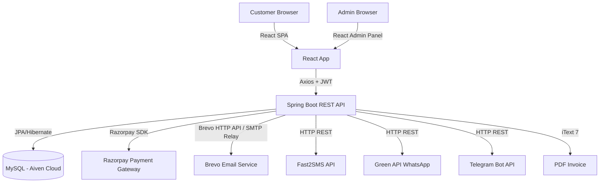
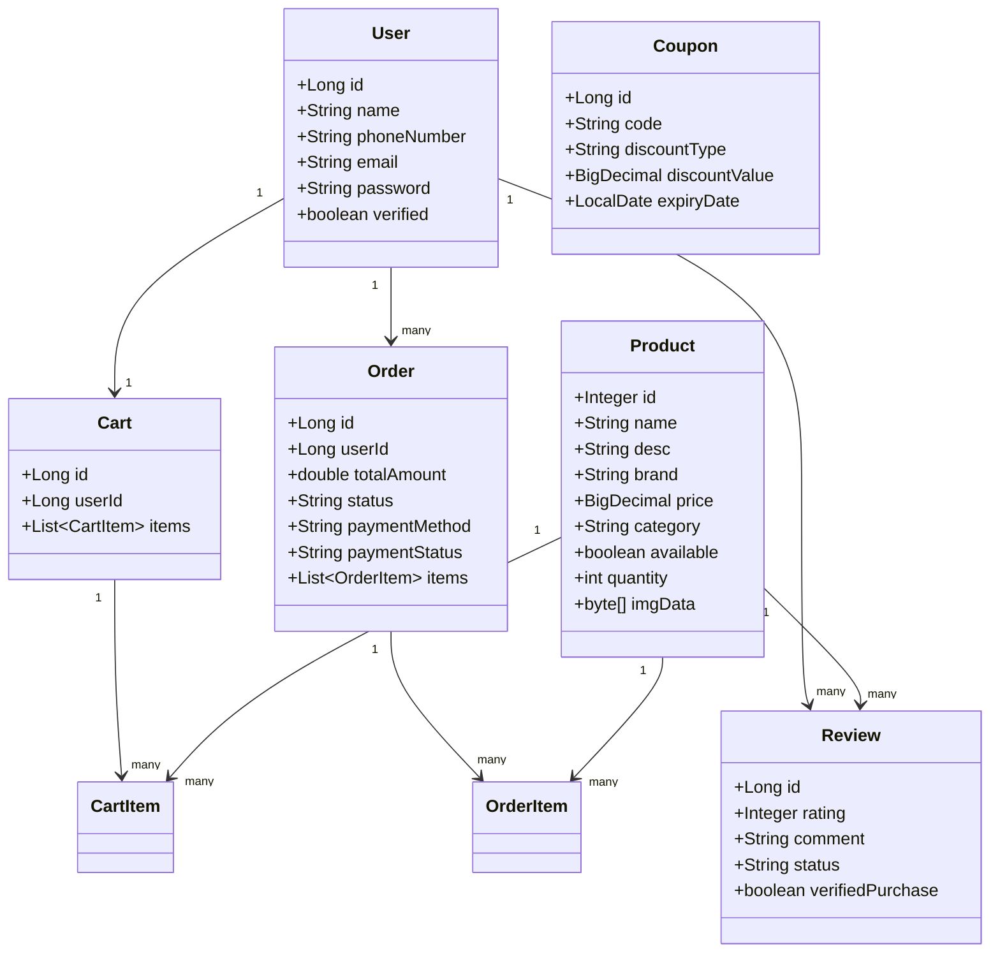
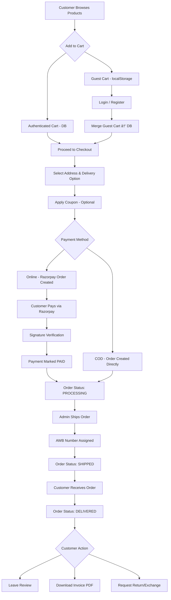
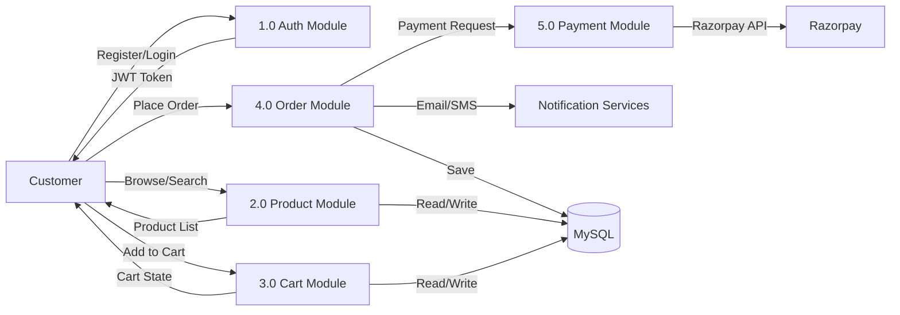
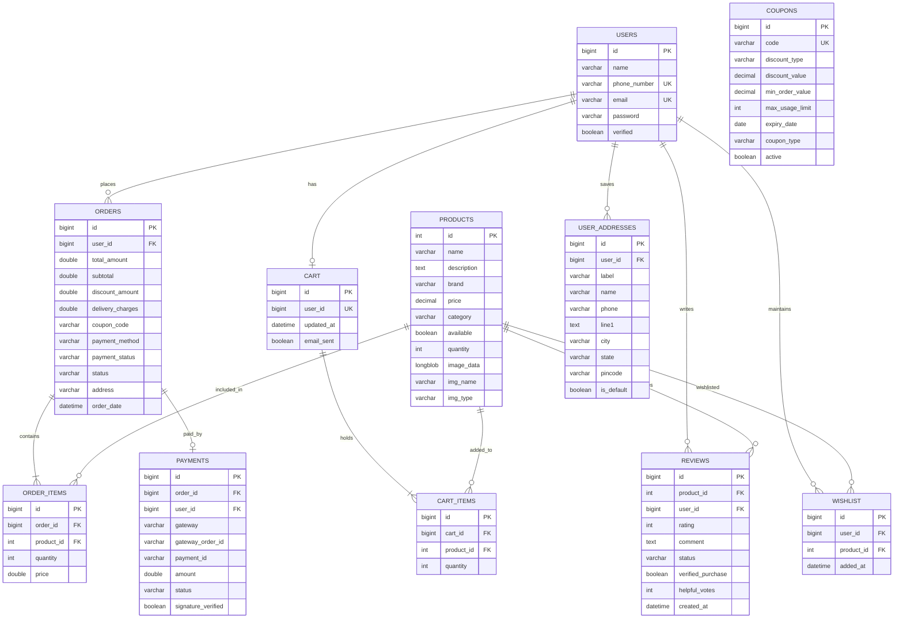

# SHRINATH CYCLE STORE — COMPLETE PROJECT DOCUMENTATION
### Professional Report for College Viva, Internship & Placement Interviews

---

**Project Name:** Shrinath Cycle Store — E-Commerce Platform  
**Developer:** Utkarsh Gupta  
**Stack:** Java 17 · Spring Boot 3.5 · React 19 · TiDB Cloud / MySQL 8 · JWT · Razorpay  
**Deployment:** Render (Backend) · TiDB Cloud / Aiven MySQL · React Build (Static Host)  
**GitHub:** Utkarshgupta2027/Shrinath-Cycle-Store

---

# PART 1: EXECUTIVE SUMMARY

## 1.1 Project Overview

Shrinath Cycle Store is a **full-stack e-commerce web application** built to digitize and scale a real-world bicycle retail shop. The platform enables customers to browse, search, filter, and purchase bicycles and accessories online, while providing the store owner (admin) with a powerful management dashboard. The system handles the complete order lifecycle — from product discovery through payment, fulfilment, and optional returns — with real-time notifications via email, SMS, and WhatsApp.

## 1.2 Problem Statement

Traditional bicycle shops operate exclusively through physical footfall. This creates severe limitations:
- Customers cannot browse inventory from home or compare products.
- The store has no visibility beyond its local geographic area.
- Manual order tracking is error-prone and slow.
- No mechanism exists to alert customers about restocked or new products.
- Revenue is lost when customers arrive and find items out of stock.

## 1.3 Existing System

Previously, Shrinath Cycle Store operated through:
- Walk-in customers only
- Phone orders with manual record-keeping in paper ledgers
- No digital payment support (cash-only)
- Product inventory tracked in manual registers
- No customer retention mechanism (no loyalty, no notifications)

## 1.4 Drawbacks of Existing System

| Drawback | Impact |
|---|---|
| No online presence | Lost sales to competitors with websites |
| Manual inventory | Overselling / underselling errors |
| Cash-only payments | Inconvenience, security risk |
| No customer data | Cannot target marketing or send promotions |
| No order tracking | Customer frustration post-purchase |
| No returns system | Customer dissatisfaction |

## 1.5 Proposed System

A modern, responsive e-commerce platform with:
- **Guest & authenticated browsing** with advanced product search/filter
- **Secure JWT-based authentication** with email OTP verification
- **Razorpay payment gateway** integration (UPI, Cards, Net Banking)
- **Admin dashboard** for complete business management
- **Real-time notifications** (Email, SMS via Fast2SMS, WhatsApp via Green API)
- **PDF invoice generation** (GST-compliant via iText 7)
- **Order tracking** with AWB/courier integration
- **Coupon & discount** management system
- **Review & rating** system with admin moderation
- **Cart abandonment** scheduler with email recovery

## 1.6 Objectives

1. Provide customers a seamless online shopping experience for bicycles.
2. Enable secure, multi-method digital payments via Razorpay.
3. Give the admin a single dashboard to manage products, orders, users, and analytics.
4. Automate customer communication through email/SMS/WhatsApp notifications.
5. Implement industry-standard security (JWT, BCrypt, rate limiting, input sanitization).
6. Support returns, refunds, and exchange requests with audit trails.
7. Generate GST-compliant PDF invoices automatically per order.

## 1.7 Scope of Project

**In Scope:**
- Customer registration (Email OTP verification), login, profile management
- Product catalog with image gallery, search, filter, sort
- Cart management (guest & authenticated), wishlist
- Checkout with address book, coupon application, delivery options
- Online payment (Razorpay) and COD support
- Order lifecycle management (PENDING → PROCESSING → SHIPPED → DELIVERED)
- Return/exchange request workflow
- Admin panel: products, orders, users, coupons, inventory, analytics
- Email, SMS, WhatsApp notifications
- PDF invoice download
- Light/Dark theme persistence
- **Self-hosted Visitor Intelligence Analytics** (site visitors, guest vs registered, browsers vs buyers, repeat customers, failed searches)

**Out of Scope:**
- Mobile native apps (iOS/Android)
- Multi-vendor marketplace
- Inventory barcode scanning

## 1.8 Benefits

- **For Customers:** 24/7 shopping, order tracking, digital invoices, multiple payment options
- **For Admin:** Real-time analytics, automated notifications, centralized order management
- **For Business:** Expanded reach, reduced manual workload, data-driven decisions
- **Technical:** Scalable cloud deployment, stateless JWT auth, optimized DB queries

## 1.9 Future Enhancements

1. Mobile app (React Native / Flutter)
2. AI-based product recommendation engine
3. Multi-vendor support
4. Barcode/QR inventory scanning
5. Loyalty points & referral program (partially implemented)
6. Social login (Google OAuth2)
7. Live chat support widget
8. Redis for session caching and visitor analytics hot-path optimization
9. Geographic heatmap for visitor intelligence (IP ? region mapping)
10. Export analytics data as CSV/Excel from admin panel

---

# PART 2: TECHNICAL ARCHITECTURE

## 2.1 System Architecture

```
┌─────────────────────────────────────────────────────────────�
│                     CLIENT LAYER                            │
│   React 19 SPA (Served via Static Hosting / CDN)           │
│   Browser: Chrome / Firefox / Safari                        │
└────────────────────────┬────────────────────────────────────┘
                         │ HTTPS + JWT Bearer Token
                         â–¼
┌─────────────────────────────────────────────────────────────�
│                    API GATEWAY (Spring Boot)                 │
│   Rate Limiting Filter → Input Sanitization → JWT Filter    │
│   Spring Security → Controllers → Services → Repositories  │
└────────────────────────┬────────────────────────────────────┘
                         │
         ┌───────────────┼───────────────────�
         â–¼               â–¼                   â–¼
   ┌──────────�   ┌─────────────�   ┌──────────────�
   │ MySQL DB │   │  Razorpay   │   │  Notif Layer │
   │ (Aiven)  │   │  Payment    │   │ Email/SMS/WA │
   └──────────┘   └─────────────┘   └──────────────┘
```

## 2.2 High-Level Design (HLD)



## 2.3 Low-Level Design (LLD)



## 2.4 Workflow Diagram — Order Lifecycle



## 2.5 Data Flow Diagram (DFD)

**Level 0 — Context Diagram:**
```
[Customer] ──── Orders, Payments, Reviews ────→ [Shrinath Store System] ──── Notifications ───→ [Customer]
[Admin]    ──── Product/Order Management ────→ [Shrinath Store System] ──── Analytics      ───→ [Admin]
                                               [Shrinath Store System] ──── Payment Data   ───→ [Razorpay]
```

**Level 1 — Main Processes:**


## 2.6 ER Diagram



## 2.7 Database Schema

### Table: `users`
| Column | Type | Constraints | Description |
|--------|------|-------------|-------------|
| id | BIGINT | PK, AUTO_INCREMENT | Unique user identifier |
| name | VARCHAR(255) | | Full name |
| phone_number | VARCHAR(255) | NOT NULL, UNIQUE | Used as login username |
| email | VARCHAR(255) | NOT NULL, UNIQUE | Email for OTP/notifications |
| password | VARCHAR(255) | NOT NULL | BCrypt hashed |
| verified | BOOLEAN | DEFAULT false | Email OTP verified flag |

### Table: `products`
| Column | Type | Constraints | Description |
|--------|------|-------------|-------------|
| id | INT | PK, AUTO_INCREMENT | Product ID |
| name | VARCHAR(255) | | Product name |
| description | TEXT | | Full description |
| brand | VARCHAR(255) | | Brand name |
| price | DECIMAL(10,2) | | Selling price in INR |
| category | VARCHAR(255) | | e.g. Mountain, Road, Kids |
| available | BOOLEAN | DEFAULT true | In-stock availability flag |
| quantity | INT | | Stock count |
| image_data | LONGBLOB | | Primary image bytes |
| img_name | VARCHAR(255) | | Image filename |
| img_type | VARCHAR(255) | | MIME type (image/jpeg) |
| release_date | DATE | | Product listing date |

### Table: `orders`
| Column | Type | Description |
|--------|------|-------------|
| id | BIGINT PK | Order ID |
| user_id | BIGINT FK | References users.id |
| total_amount | DOUBLE | Final amount after discount + delivery |
| subtotal | DOUBLE | Raw cart total |
| discount_amount | DOUBLE | Coupon savings |
| delivery_charges | DOUBLE | Standard/Express/Free |
| coupon_code | VARCHAR | Applied coupon code |
| payment_method | VARCHAR | RAZORPAY / COD |
| payment_status | VARCHAR | PENDING / PAID / FAILED |
| status | VARCHAR | PENDING / PROCESSING / SHIPPED / DELIVERED / CANCELLED |
| address | TEXT | Shipping address snapshot |
| awb_number | VARCHAR | Courier tracking number |
| courier_name | VARCHAR | Courier company |
| order_date | DATETIME | When order was placed |

## 2.8 API Architecture

RESTful API following standard HTTP conventions:
- Base URL: `https://<backend>.onrender.com`
- Authentication: Bearer JWT in `Authorization` header
- Content-Type: `application/json`
- Versioning: Path-based (`/api/...`)
- Error format: `{ "message": "Error description" }`

## 2.9 Frontend Architecture

```
React 19 SPA
├── AppProvider (React Context — global state)
│   ├── user, cart, cartCount
│   ├── login(), logout(), addToCart(), removeFromCart()
│   └── Guest cart → localStorage; Auth cart → Backend API
├── React Router v7 (Client-side routing)
│   ├── Eager: Home, Login, Register
│   └── Lazy (code-split): Cart, Product, Orders, Admin, etc.
├── Axios Instance (axiosInstance.js)
│   ├── Automatic JWT attachment on every request
│   └── Auto-refresh on 401 with queue management
└── Theme System (utils/theme.js)
    ├── Light/Dark via CSS custom properties
    └── Persisted in localStorage, synced across tabs
```

## 2.10 Backend Architecture

```
Spring Boot 3.5 (Java 17)
├── Security Layer
│   ├── RateLimitingFilter     → Blocks brute-force (5 req/60s)
│   ├── InputSanitizationFilter → XSS prevention
│   └── JwtAuthenticationFilter → Token validation per request
├── Controller Layer           → HTTP request/response mapping
├── Service Layer              → Business logic
├── Repository Layer           → JPA data access (Spring Data)
├── Model Layer                → JPA entities (Lombok @Data)
└── DTO Layer                  → Request/Response data contracts
```
---

# PART 3: TECHNOLOGY STACK EXPLANATION

## 3.1 Java 17

**Definition:** Java is a statically-typed, object-oriented, platform-independent programming language. Java 17 is an LTS (Long-Term Support) release.

**Why Used:** Spring Boot 3.x requires Java 17+. LTS guarantees long-term security patches critical for production.

**Advantages:** Strong typing catches bugs at compile-time; vast ecosystem; JVM optimizes bytecode at runtime (JIT); excellent concurrency support.

**Alternatives:** Kotlin (JVM, more concise), Go (faster startup), Node.js (single-threaded event loop).

**Interview Questions:**
1. What is the difference between JDK, JRE, and JVM?
2. What are sealed classes introduced in Java 17?
3. Explain `var` keyword in Java (local type inference).
4. What is the difference between `==` and `.equals()`?
5. Explain garbage collection in Java.

---

## 3.2 Spring Boot 3.5

**Definition:** Spring Boot is an opinionated framework built on top of Spring that auto-configures applications and allows you to run standalone Java apps with embedded servers.

**Why Used:** Eliminates boilerplate Spring XML configuration; provides auto-configuration for JPA, Security, Mail, Multipart; embedded Tomcat for standalone deployment.

**Advantages:** Production-ready features (health checks, metrics); convention over configuration; massive community; excellent documentation.

**Alternatives:** Quarkus (faster startup, GraalVM native), Micronaut (compile-time DI), Jakarta EE.

**Key Annotations Used in This Project:**
| Annotation | Layer | Purpose |
|---|---|---|
| `@SpringBootApplication` | Entry | Enables component scan, auto-config |
| `@RestController` | Controller | Marks HTTP handler class |
| `@RequestMapping` | Controller | Base URL path |
| `@GetMapping` / `@PostMapping` | Controller | HTTP method mapping |
| `@Service` | Service | Business logic bean |
| `@Repository` | Repository | Data access bean |
| `@Entity` | Model | JPA-managed table |
| `@Transactional` | Service | ACID transaction boundary |
| `@Value` | Any | Injects from application.properties |
| `@Autowired` | Any | Dependency injection |

**Interview Questions:**
1. What is the difference between `@Component`, `@Service`, `@Repository`, and `@Controller`?
2. How does Spring Boot auto-configuration work?
3. What is `@Transactional` and what happens if an exception is thrown inside it?
4. Explain the Spring Bean lifecycle.
5. What is the difference between `@RequestBody` and `@RequestParam`?

---

## 3.3 Spring Security

**Definition:** A powerful authentication and access-control framework for Spring applications.

**Why Used:** Provides JWT filter integration, role-based authorization (`ROLE_ADMIN` vs `ROLE_CUSTOMER`), CORS configuration, and CSRF protection management.

**Implementation in Project:**
- `SecurityConfig` defines which endpoints are public vs authenticated vs admin-only.
- `JwtAuthenticationFilter` validates Bearer tokens on every request.
- `RateLimitingFilter` (custom) prevents brute-force attacks.
- `InputSanitizationFilter` (custom) strips HTML/script tags from inputs.
- Stateless session (`SessionCreationPolicy.STATELESS`) — no server-side sessions.

**Interview Questions:**
1. What is CSRF and why is it disabled in stateless JWT APIs?
2. Explain how Spring Security filter chain works.
3. What is the difference between authentication and authorization?
4. How do you secure specific endpoints to be admin-only in Spring Security?
5. What is CORS and why is it needed?

---

## 3.4 Spring Data JPA / Hibernate

**Definition:** JPA (Jakarta Persistence API) is a specification for ORM (Object-Relational Mapping). Hibernate is the default JPA implementation. Spring Data JPA provides repositories with built-in CRUD operations.

**Why Used:** Eliminates raw SQL for common CRUD operations; supports JPQL and custom `@Query`; `ddl-auto=update` auto-migrates schema.

**Key Concepts Used:**
- `@Entity` — maps Java class to DB table
- `@OneToMany`, `@ManyToOne` — JPA relationships
- `CascadeType.ALL` — propagates operations to child entities
- `@Transactional` — wraps multi-step DB operations in a single transaction
- `JpaRepository<T, ID>` — provides `save()`, `findAll()`, `findById()`, `delete()`

**Interview Questions:**
1. What is the N+1 query problem and how do you fix it?
2. What is `FetchType.LAZY` vs `FetchType.EAGER`?
3. What is the difference between `save()` and `saveAndFlush()`?
4. Explain `@OneToMany` vs `@ManyToMany` with an example.
5. What is `orphanRemoval = true` in JPA?

---

## 3.5 React 19

**Definition:** React is a JavaScript library for building component-based user interfaces. React 19 brings concurrent rendering, Server Components, and improved hooks.

**Why Used:** Component reusability (Navbar, Cart, Product cards); virtual DOM for efficient re-renders; React Router for SPA navigation; Context API for global state.

**Key Features Used:**
- `useState`, `useEffect`, `useCallback`, `useContext` — hooks
- `React.lazy()` + `Suspense` — code splitting for performance
- `React Router v7` — client-side routing with `useLocation`, `useNavigate`
- `AppContext` — global state (user, cart, theme)
- `axios` — HTTP client with interceptors

**Interview Questions:**
1. What is the Virtual DOM and how does React use it?
2. Explain the difference between `useEffect` and `useLayoutEffect`.
3. What is the purpose of the dependency array in `useEffect`?
4. What is React Context API and when would you use Redux instead?
5. What is `React.memo()` and `useMemo()`? When do you use them?

---

## 3.6 JWT (JSON Web Tokens)

**Definition:** JWT is a compact, URL-safe token format used for stateless authentication. It consists of three Base64-encoded parts: Header.Payload.Signature.

**Why Used:** Enables stateless auth — no session storage on server; tokens are self-contained (contain user identity and expiry).

**Implementation in Project:**
- **Access Token:** 24-hour lifespan, signed with HS512
- **Refresh Token:** 7-day lifespan, stored server-side in `RefreshTokenStore` (in-memory ConcurrentHashMap)
- Claims: `subject` = phone number, `type` = ACCESS or REFRESH
- On 401: frontend's Axios interceptor automatically calls `/api/auth/refresh` and retries

**Interview Questions:**
1. What are the three parts of a JWT?
2. What is the difference between an access token and a refresh token?
3. Where should JWTs be stored — localStorage or httpOnly cookies?
4. How do you invalidate a JWT before it expires?
5. What algorithm does this project use to sign JWTs and why?

---

## 3.7 MySQL 8 (Aiven Cloud)

**Definition:** MySQL is a relational database management system using SQL. Hosted on Aiven Cloud with SSL-required connections.

**Why Used:** Well-supported by Spring Data JPA/Hibernate; strong ACID compliance for financial transactions; familiar SQL for reporting; Aiven provides managed, cloud-hosted MySQL with automated backups.

**Interview Questions:**
1. What is the difference between `INNER JOIN` and `LEFT JOIN`?
2. What is database indexing and how does it improve performance?
3. What are primary keys and foreign keys?
4. What is a transaction? Explain ACID properties.
5. What is the difference between `DELETE`, `TRUNCATE`, and `DROP`?

---

## 3.8 Razorpay Payment Gateway

**Definition:** Razorpay is an Indian payment gateway that supports UPI, cards, net banking, and wallets.

**Why Used:** Best-in-class Indian payment gateway; free test mode; supports automatic refunds via API; webhook support for async payment confirmation.

**Flow in Project:**
1. `POST /api/payments/create` → calls Razorpay API to create an order → returns `razorpay_order_id`
2. Frontend opens Razorpay checkout modal
3. Customer pays → Razorpay calls webhook or frontend receives `razorpay_payment_id` + `razorpay_signature`
4. `POST /api/payments/verify` → backend verifies HMAC-SHA256 signature
5. Order status updated to PAID; email/SMS sent to customer

**Interview Questions:**
1. What is HMAC signature verification and why is it critical for payment security?
2. What is the difference between a payment order ID and a payment ID in Razorpay?
3. What is a webhook? How is it different from polling?
4. How do you handle a case where a payment succeeds but the webhook fails to arrive?

---

## 3.9 Lombok

**Definition:** Lombok is a Java annotation processor that auto-generates boilerplate code (getters, setters, constructors, toString, equals/hashCode).

**Why Used:** Reduces code verbosity by 60%. `@Data` generates all getters/setters/toString/equals/hashCode. `@AllArgsConstructor`, `@NoArgsConstructor` generate constructors.

**Interview Questions:**
1. What does `@Data` generate in Lombok?
2. What is the difference between `@Data` and `@Value` in Lombok?
3. Can Lombok cause issues with JPA entities? (`@EqualsAndHashCode` on lazy fields)

---

## 3.10 iText 7 (PDF Generation)

**Definition:** iText 7 is a Java library for creating and manipulating PDF documents programmatically.

**Why Used:** Generates GST-compliant PDF invoices with order details, product breakdown, tax calculation, and store branding — delivered as a downloadable byte array.

---

## 3.11 Maven

**Definition:** Maven is a Java build automation and dependency management tool using a `pom.xml` descriptor.

**Why Used:** Manages all dependencies (Spring Boot, JWT, Razorpay SDK, iText); standardizes build lifecycle (compile → test → package → deploy).

**Key Maven Commands:**
```bash
mvn clean install       # Clean build + package
mvn spring-boot:run     # Run locally
mvn package -DskipTests # Package without running tests
```

---

# PART 4: FOLDER STRUCTURE EXPLANATION

## 4.1 Backend (Java/Spring Boot)

```
Shrinath/
├── src/main/java/GuptaCycle/org/Shrinath/
│   ├── ShrinathApplication.java     � @SpringBootApplication entry point
│   ├── Config/
│   │   ├── SecurityConfig.java      � Spring Security filter chain, CORS config
│   │   └── PasswordConfig.java      � BCryptPasswordEncoder @Bean
│   ├── Controller/                  � HTTP request handlers (REST endpoints)
│   │   ├── AuthController.java      � Register, Login, Refresh, Logout, Profile
│   │   ├── ProductController.java   � CRUD products, image serving
│   │   ├── OrderController.java     � Place, track, cancel, invoice download
│   │   ├── PaymentController.java   � Razorpay create/verify/webhook
│   │   ├── CartController.java      � Add/remove/clear cart items
│   │   ├── WishlistController.java  � Add/remove wishlist items
│   │   ├── ReviewController.java    � Submit/moderate reviews
│   │   ├── CouponController.java    � Create/apply/list coupons
│   │   ├── AddressController.java   � CRUD saved addresses
│   │   ├── ShippingController.java  � Serviceable PIN check, AWB assignment
│   │   ├── InventoryController.java � Low stock alerts, restock subscriptions
│   │   ├── FeedbackController.java  � Contact form submissions
│   │   ├── CategoryController.java  � Product categories
│   │   ├── BrandController.java     � Product brands
│   │   ├── StoreSettingsController.java � Store info (name, address, hours)
│   │   └── HomeController.java      � Basic health/ping endpoint
│   ├── Service/                     � Business logic layer
│   │   ├── AuthService.java         � Login, registration, OTP, account CRUD
│   │   ├── ProductService.java      � Product CRUD, search, filter, sort
│   │   ├── OrderService.java        � Order lifecycle, pricing, refunds
│   │   ├── PaymentService.java      � Razorpay integration, signature verify
│   │   ├── CartService.java         � Cart state management
│   │   ├── CouponService.java       � Coupon validation & application
│   │   ├── ReviewService.java       � Review CRUD, helpful votes
│   │   ├── EmailService.java        � All transactional email templates
│   │   ├── SmsService.java          � Fast2SMS integration
│   │   ├── WhatsAppService.java     � Green API, CallMeBot, Telegram
│   │   ├── InvoiceService.java      � iText 7 PDF invoice generation
│   │   ├── OtpService.java          � In-memory OTP store with expiry
│   │   ├── ShippingService.java     � PIN serviceability, AWB tracking
│   │   ├── RazorpayRefundService.java � Refund API calls
│   │   ├── FeedbackService.java     � Store customer feedback
│   │   ├── WishlistService.java     � Wishlist operations
│   │   ├── AddressService.java      � Address book CRUD
│   │   ├── BrandService.java        � Brand management
│   │   ├── CategoryService.java     � Category management
│   │   └── StoreSettingsService.java � Store settings CRUD
│   ├── Repository/                  � Spring Data JPA interfaces
│   │   ├── UserRepository.java
│   │   ├── ProductRepo.java         � Custom @Query for search/filter
│   │   ├── OrderRepository.java     � Custom queries for analytics
│   │   ├── ReviewRepository.java    � Avg rating, review stats
│   │   └── ...16 total repositories
│   ├── Model/                       � JPA @Entity classes (DB tables)
│   │   ├── User.java                → users table
│   │   ├── Product.java             → products table
│   │   ├── Order.java               → orders table
│   │   ├── OrderItem.java           → order_items table
│   │   ├── Cart.java                → cart table
│   │   ├── CartItem.java            → cart_items table
│   │   ├── Review.java              → reviews table
│   │   ├── Coupon.java              → coupons table
│   │   ├── UserAddress.java         → user_addresses table
│   │   ├── Wishlist.java            → wishlist table
│   │   ├── Payment.java             → payments table
│   │   ├── ProductImage.java        → product_images table
│   │   ├── RestockSubscription.java → restock_subscriptions table
│   │   ├── ReturnExchangeRequest.java → return_exchange_requests table
│   │   ├── ServiceablePin.java      → serviceable_pins table
│   │   ├── Feedback.java            → feedback table
│   │   ├── StoreSettings.java       → store_settings table
│   │   ├── Brand.java               → brands table
│   │   ├── Category.java            → categories table
│   │   └── UserDetailsImpl.java     � Spring Security UserDetails adapter
│   ├── DTO/                         � Data Transfer Objects
│   │   ├── ProductResponse.java     � Product + review stats (no image bytes)
│   │   ├── UserAccountResponse.java � Safe user info (no password)
│   │   ├── AdminAnalyticsResponse.java � Dashboard metrics
│   │   ├── PaymentCreateRequest/Response.java � Razorpay order creation
│   │   └── ...18 total DTOs
│   ├── Security/                    � Security components
│   │   ├── JwtUtils.java            � Token generation, validation, parsing
│   │   ├── JwtAuthenticationFilter.java � Per-request JWT validation filter
│   │   ├── RateLimitingFilter.java  � IP-based brute force protection
│   │   ├── InputSanitizationFilter.java � XSS prevention
│   │   └── RefreshTokenStore.java   � In-memory refresh token validity store
│   └── Scheduler/
│       └── CartAbandonmentScheduler.java � Scheduled task: detect & email abandoned carts
├── src/main/resources/
│   └── application.properties       � All config (DB, JWT, Mail, Razorpay, Twilio)
└── pom.xml                          � Maven dependencies
```

## 4.2 Frontend (React)

```
shreenath-frontend/src/
├── App.js                    � Root: Router, Suspense, AppLayout, theme sync
├── index.js                  � ReactDOM.render entry, theme pre-init
├── index.css                 � Global CSS reset, fonts
├── config.js                 � API_BASE_URL (env var driven)
├── Context/
│   ├── Context.jsx           � createContext() definition
│   └── AppProvider.jsx       � Global state: user, cart, auth functions
├── api/
│   ├── axiosInstance.js      � Axios with JWT interceptor & refresh logic
│   └── products.js           � Simple product fetch helper
├── components/               � Reusable React components
│   ├── Navbar.jsx            � Top navigation, search, cart icon, theme toggle
│   ├── Home.jsx              � Landing page (hero, featured products, categories)
│   ├── Product.jsx           � Product detail page (images, reviews, add to cart)
│   ├── Cart.jsx              � Shopping cart with quantity controls
│   ├── Login.jsx             � Login form with JWT response handling
│   ├── Register.jsx          � Multi-step registration with email OTP
│   ├── CheckoutPopup.jsx     � Address selection, coupon, delivery options
│   ├── MakePayment.jsx       � Razorpay integration, COD flow
│   ├── orders.jsx            � Order history, cancel, return, invoice download
│   ├── UserAccount.jsx       � Profile view, order summary
│   ├── Settings.jsx          � Edit profile, change password, delete account
│   ├── Wishlist.jsx          � Wishlist management
│   ├── AddressBook.jsx       � Saved addresses CRUD
│   ├── Feedback.jsx          � Contact/feedback form
│   ├── AddProduct.jsx        � Admin: add new product with images
│   ├── UpdateProduct.jsx     � Admin: edit existing product
│   ├── SearchFilterBar.jsx   � Product filter/sort controls
│   ├── Footer.jsx            � Site footer
│   └── NotifyMeModal.jsx     � Out-of-stock restock notification signup
├── pages/
│   ├── AdminPanel.jsx        � Full admin dashboard (tabs: products, orders, users)
│   ├── Dashboard.jsx         � Admin redirect wrapper
│   └── TrackOrder.jsx        � Order tracking with AWB status
├── utils/
│   ├── theme.js              � syncThemeFromStorage, THEME_EVENT constant
│   └── auth.js               � getStoredUser, setStoredUser, clearStoredAuth
└── styles/                   � Component-specific CSS files
```
---

# PART 5: COMPLETE FUNCTION DOCUMENTATION

## 5.1 Backend — AuthService.java

### `authenticateUser(String identifier, String rawPassword)`
**Purpose:** Validates credentials and returns the matching User entity.

**Parameters:**
- `identifier` — phone number or email (login can use either)
- `rawPassword` — plain-text password from client

**Return Type:** `User` or `null`

**Business Logic:**
1. Normalize the identifier (trim whitespace)
2. Attempt lookup by phone number; if not found, attempt by email
3. If user found, verify BCrypt hash: `passwordEncoder.matches(rawPassword, user.getPassword())`
4. If identifier matches admin credentials configured in environment variables, upsert the admin user record
5. Return matched `User` or `null` if authentication fails

**Time Complexity:** O(1) — single DB lookup by indexed column  
**Space Complexity:** O(1)

**Edge Cases:**
- Empty/null identifier or password → returns null
- Admin can log in with either phone or email
- BCrypt hash comparison is timing-safe (prevents timing attacks)

**Example Input:** `identifier = "9999999999"`, `rawPassword = "secret123"`  
**Example Output:** `User { id=1, name="Utkarsh", phoneNumber="9999999999", ... }`

**Interview Questions:**
1. Why do we use BCrypt instead of MD5 for password storage?
2. What is a timing attack and how does BCrypt prevent it?
3. Why should login allow both phone and email? What are the UX implications?

---

### `registerUser(User user)`
**Purpose:** Persists a new verified user after OTP confirmation.

**Parameters:**
- `user` — User entity with name, email, phone, plain-text password

**Business Logic:**
1. Normalize email to lowercase, trim all fields
2. Check for duplicate email in `userRepository.findByEmail(email)` → throw if exists
3. Check for duplicate phone → throw if exists
4. Hash password: `passwordEncoder.encode(user.getPassword())`
5. Set `verified = true` (OTP already verified before this call)
6. `userRepository.save(user)` → returns saved entity with generated ID

**Time Complexity:** O(1)  
**Edge Cases:** Duplicate email/phone throws `RuntimeException` with user-friendly message

---

### `deleteAccount(String phoneNumber)`
**Purpose:** Completely removes a user and all their associated data in the correct FK-safe order.

**Parameters:** `phoneNumber` — identifies the user to delete

**Business Logic (Transactional — all-or-nothing):**
1. Find user by phone → throw if not found
2. `wishlistRepository.deleteByUser(user)` — removes wishlist entries
3. `reviewRepository.deleteByUser(user)` — removes reviews (critical FK blocker)
4. `cartRepository.deleteByUserId(user.getId())` — removes cart
5. `userAddressRepository.deleteAll(...)` — removes saved addresses
6. `restockSubscriptionRepository.deleteByUserId(...)` — removes restock subs
7. `couponRepository.deleteByOwnedByUserId(...)` — removes personal coupons
8. `userRepository.delete(user)` — finally deletes the user record

**@Transactional ensures:** If any step fails, all steps roll back.

**Interview Questions:**
1. Why does the order of deletion matter? (FK constraint violations)
2. What happens if `@Transactional` is missing on this method?
3. What is the difference between cascading deletes in JPA vs manual deletion?

---

### `generatePasswordResetOtp(String email)`
**Purpose:** Sends a 6-digit OTP to the user's email for password reset.

**Business Logic:**
1. Find user by email → throw if not found
2. `otpService.generateOtp(email)` — generates & stores OTP with 10-min expiry
3. `emailService.sendPasswordResetOtpEmail(email, otp)` — sends HTML email
4. On Brevo email delivery failure: clear the OTP (no dangling unusable OTPs) and throw user-friendly error

---

## 5.2 Backend — ProductService.java

### `getFilteredProducts(...)`
**Purpose:** Backend-filtered product search with support for keyword, category, brand, price range, stock filter, and sort.

**Parameters:**
- `keyword` — searches name, brand, category, description
- `category` — exact match (case-insensitive)
- `brand` — exact match (case-insensitive)
- `minPrice`, `maxPrice` — price range (null = unbounded)
- `inStockOnly` — if true, only return `available = true AND quantity > 0`
- `sortBy` — `PRICE_ASC | PRICE_DESC | NEWEST | RATING | POPULARITY`

**Business Logic:**
1. `repo.findFiltered(...)` — executes custom JPQL query
2. `toProductResponseList(products)` — maps Product entities to DTOs (strips image bytes, adds review stats)
3. `sort(responses, sortBy)` — in-memory sort using Comparator

**Return Type:** `List<ProductResponse>`

**Time Complexity:** O(n log n) for sort step  
**Space Complexity:** O(n) for result list

**Interview Questions:**
1. Why return `ProductResponse` DTO instead of the `Product` entity directly?
2. What is the N+1 query problem and how does batch-fetching review stats solve it?
3. What are the trade-offs of in-memory sort vs DB-level ORDER BY?

---

### `addProduct(Product product, MultipartFile imgFile, List<MultipartFile> extraImages)`
**Purpose:** Creates a new product with primary image and optional gallery images.

**Business Logic:**
1. Read primary image bytes from `imgFile.getBytes()`
2. Set `product.imgData`, `product.imgName`, `product.imgType`
3. `repo.save(product)` — persists with generated ID
4. For each `extraImage`: create `ProductImage` entity, store bytes, link to product
5. `productImageRepository.saveAll(extraImages)` — batch save gallery
6. If product previously out-of-stock and now available: query `restockSubscriptionRepository` and send email alerts

**Edge Cases:**
- `imgFile` null → throw validation error
- `extraImages` null or empty → skip gallery step
- IOException on `getBytes()` → propagate wrapped exception

---

## 5.3 Backend — OrderService.java

### `saveOrder(OrderRequest req, boolean markPaid)`
**Purpose:** Core order creation — validates stock, applies coupon, calculates pricing, and persists the order.

**Parameters:**
- `req` — contains userId, items, address, couponCode, deliveryOption, paymentMethod
- `markPaid` — true for COD orders (immediately mark as PAID)

**Business Logic:**
1. Validate `req` and `req.getUserId()` not null
2. For each order item: load product, verify `available = true`, check `quantity >= requested`
3. Calculate subtotal from product prices × quantities
4. Apply coupon via `couponService.applyCoupon(couponCode, subtotal, userId)` → discount amount
5. Calculate delivery: Standard shipping is FREE (delivery charges = ₹0); Express shipping is ₹199 or dynamically calculated based on pincode weight
6. Deduct stock: `product.setQuantity(current - ordered)` for each item
7. Create `Order` entity, set all financial fields, save via `orderRepo.save(order)`
8. Send order confirmation email, SMS, WhatsApp notifications asynchronously
9. Clear user's cart after successful order

**Time Complexity:** O(n) where n = number of order items  
**Transactional:** Yes — stock deduction + order save in one transaction

**Edge Cases:**
- Item out of stock mid-checkout → throw `IllegalArgumentException` before stock deduction
- Invalid coupon → coupon service throws, order not created
- Delivery option not provided → default to STANDARD

---

### `cancelOrder(Long orderId, String reason)`
**Purpose:** Cancels an order if it's still in a cancellable state.

**Business Logic:**
1. Find order by ID or throw
2. Check status: only `PENDING` and `PROCESSING` can be cancelled
3. Set `order.status = "CANCELLED"`, `order.cancellationReason = reason`
4. Restore stock for each order item
5. If paid via Razorpay: trigger refund via `razorpayRefundService`
6. Send cancellation email/SMS to customer
7. Send admin notification

---

## 5.4 Backend — JwtUtils.java

### `generateToken(String phoneOrUsername)`
**Purpose:** Creates a short-lived (24h) JWT access token signed with HS512.

**Parameters:** `phoneOrUsername` — stored as JWT subject claim

**Business Logic:**
1. Build JWT: subject=phoneNumber, claim type=ACCESS, issuedAt=now, expiry=now+24h
2. Sign with HS512 using SHA-512 derived key (if secret < 64 bytes)
3. Return compact string: `header.payload.signature`

**Return Type:** `String` (JWT compact serialization)

---

### `validateJwtToken(String token)`
**Purpose:** Returns true if token signature is valid and not expired.

**Business Logic:**
1. `Jwts.parserBuilder().setSigningKey(getSigningKey()).build().parseClaimsJws(token)`
2. Any exception (expired, malformed, invalid signature) → catch all and return false

**Time Complexity:** O(1) — HMAC verification is constant time

---

## 5.5 Frontend — AppProvider.jsx

### `addToCart(product, quantity = 1)`
**Purpose:** Adds a product to cart. Routes to backend API for logged-in users or localStorage for guests.

**Business Logic (Authenticated):**
1. POST `/api/cart/add?userId=...&productId=...&quantity=...`
2. On success → `fetchCart(user.id)` to refresh cart state from DB

**Business Logic (Guest):**
1. Read current `guest_cart` from localStorage
2. If product exists: increment quantity; else append new item
3. Save to localStorage, update `cart` and `cartCount` state

**Edge Cases:**
- API returns non-ok → throw error (shown in UI toast/alert)
- Guest cart limit: no hard limit (client-enforced UX)

---

### `mergeCart(userId, token)`
**Purpose:** After login, migrates guest cart items to the authenticated user's backend cart.

**Business Logic:**
1. Read `guest_cart` from localStorage
2. For each item: POST `/api/cart/add` with userId + token
3. Clear `guest_cart` from localStorage
4. `fetchCart(userId)` — load merged cart from backend

**Edge Cases:**
- Network failure on individual items: logs error, continues with remaining items
- Guest cart empty: skip merge, directly fetch backend cart

---

## 5.6 Frontend — axiosInstance.js

### Response Interceptor (Token Refresh Logic)
**Purpose:** Transparently refreshes expired access tokens and retries failed requests.

**Business Logic:**
1. If response status = 401 and `_retry` flag not set:
   a. Check if refresh already in progress (`isRefreshing`)
   b. If yes: queue this request in `failedQueue`
   c. If no: POST `/api/auth/refresh` with stored `refreshToken`
   d. On success: store new token, flush `failedQueue` with new token, retry original request
   e. On failure: call `clearAuthAndRedirect()` → clear storage, redirect to `/login`
2. If `_retry` already set: reject (prevents infinite loops)

**Interview Questions:**
1. Why do we need a `failedQueue` — what happens without it on concurrent 401s?
2. What is the risk of storing tokens in localStorage? What is the alternative?
3. Why do we avoid redirecting to `/login` if already on `/login`?

## 5.7 Frontend — keepAlive.js

### startKeepAlive()
**Purpose:** Prevents the Render free-tier backend from auto-shutting down due to 15-minute inactivity by sending a lightweight ping every 10 minutes.

**Business Logic:**
1. Fires an immediate GET /api/products?size=1 request on app startup (background, no-await)
2. Registers a setInterval for 10-minute repetition (600,000 ms)
3. Uses the existing public product endpoint - no new backend endpoint needed
4. On network error: logs a warning silently - never crashes the UI
5. Returns a cleanup function for testability

**Why /api/products?size=1:** Already permitAll() in SecurityConfig.java (no auth required), minimal response payload, exercises the full Spring Boot + DB stack.

**Called from:** index.js at startup - before React mounts.

**Interview Questions:**
1. Why is a keep-alive needed on Render's free tier?
2. Why not use /actuator/health for the ping endpoint?
3. What is setInterval and how would you cancel it?
4. Why is the ping fired immediately on startup, not just after the first interval?

---

## 5.8 Frontend — preCacheData.js

### preCacheData()
**Purpose:** Warms up the Service Worker's API cache by background-fetching 6 critical public endpoints after app load, so all subsequent visits load data instantly from cache.

**Business Logic:**
1. Waits 3 seconds after app load (avoids competing with initial render)
2. Calls fetch() on 6 URLs with cache: 'default' (allows SW to intercept and cache)
3. Uses Promise.allSettled() so one failed URL never blocks others
4. All errors swallowed silently - this is a best-effort warm-up

**URLs Pre-fetched:**
| URL | Purpose |
|---|---|
| /api/products?size=12 | First page of products (homepage) |
| /api/categories | All product categories |
| /api/categories/featured | Featured categories (navbar/homepage) |
| /api/brands | All brands |
| /api/brands/featured | Featured brands (homepage) |
| /api/settings | Store name, logo, contact info |

**How it works with Service Worker:** SW fetch event handler intercepts these requests and stores in shrinath-api-v2 cache with sw-cached-at timestamp. On next visit: served from cache instantly, background refresh updates it.

**Called from:** index.js at startup - runs after startKeepAlive().

**Interview Questions:**
1. Why wait 3 seconds before pre-fetching?
2. What is Promise.allSettled() vs Promise.all()?
3. Why use cache: 'default' instead of cache: 'no-store'?
4. How does this interact with the Service Worker?

---
---

# PART 6: DATABASE DOCUMENTATION

## 6.1 `users` Table
**Purpose:** Stores registered customer and admin accounts.

| Column | Type | Constraints | Description |
|--------|------|-------------|-------------|
| id | BIGINT | PK, AUTO_INCREMENT | Unique user ID |
| name | VARCHAR(255) | | Full display name |
| phone_number | VARCHAR(255) | NOT NULL, UNIQUE | Login identifier |
| email | VARCHAR(255) | NOT NULL, UNIQUE | Notification email |
| password | VARCHAR(255) | NOT NULL | BCrypt hash (60 chars) |
| verified | BOOLEAN | DEFAULT false | True after email OTP |

**Relationships:** One user → many orders, many cart items, many reviews, many addresses.

---

## 6.2 `products` Table
**Purpose:** The product catalog — all bicycles and accessories.

| Column | Type | Constraints | Description |
|--------|------|-------------|-------------|
| id | INT | PK, AUTO_INCREMENT | Product ID |
| name | VARCHAR(255) | | Display name |
| description | TEXT | | Full HTML/text description |
| brand | VARCHAR(255) | | Brand (Hero, Atlas, etc.) |
| price | DECIMAL(10,2) | | Price in INR |
| category | VARCHAR(255) | | Mountain / Road / Kids / etc. |
| release_date | DATE | | Date added to catalog |
| available | BOOLEAN | | Whether purchasable |
| quantity | INT | | Stock count |
| img_name | VARCHAR(255) | | Primary image filename |
| img_type | VARCHAR(255) | | MIME type e.g. image/jpeg |
| image_data | LONGBLOB | | Raw image bytes |

---

## 6.3 `orders` Table
**Purpose:** Records every placed order with financial and logistics details.

| Column | Type | Description |
|--------|------|-------------|
| id | BIGINT PK | Order ID |
| user_id | BIGINT FK → users.id | Buyer |
| total_amount | DOUBLE | Final charged amount |
| subtotal | DOUBLE | Pre-discount cart total |
| discount_amount | DOUBLE | Coupon savings |
| delivery_charges | DOUBLE | Delivery fee (0 / 199 or dynamic based on pincode) |
| coupon_code | VARCHAR | Applied coupon |
| delivery_option | VARCHAR | STANDARD / EXPRESS / FREE |
| payment_method | VARCHAR | RAZORPAY / COD |
| payment_status | VARCHAR | PENDING / PAID / FAILED |
| payment_gateway_order_id | VARCHAR | Razorpay order_id |
| payment_id | VARCHAR | Razorpay payment_id |
| signature_verified | BOOLEAN | HMAC verification result |
| paid_at | DATETIME | Payment timestamp |
| status | VARCHAR | PENDING/PROCESSING/SHIPPED/DELIVERED/CANCELLED |
| address | TEXT | Snapshot of shipping address at order time |
| awb_number | VARCHAR | Courier Air Waybill number |
| courier_name | VARCHAR | e.g. Delhivery, DTDC |
| tracking_url | VARCHAR | External tracking link |
| order_date | DATETIME | Order placement time |
| refund_id | VARCHAR | Razorpay refund ID |
| refund_status | VARCHAR | initiated / processed |
| refund_amount | DOUBLE | Refunded amount |
| gst_amount | DOUBLE | Total GST computed for invoice |

---

## 6.4 `order_items` Table
**Purpose:** Line items within each order.

| Column | Type | Description |
|--------|------|-------------|
| id | BIGINT PK | Line item ID |
| order_id | BIGINT FK → orders.id | Parent order |
| product_id | INT FK → products.id | Product ordered |
| quantity | INT | Units ordered |
| price | DOUBLE | Price per unit at time of order |

---

## 6.5 `cart` Table
**Purpose:** Each authenticated user has exactly one persistent cart.

| Column | Type | Description |
|--------|------|-------------|
| id | BIGINT PK | Cart ID |
| user_id | BIGINT UNIQUE FK | One cart per user |
| updated_at | DATETIME | Last item add/remove time |
| email_sent | BOOLEAN | Cart abandonment email sent flag |

---

## 6.6 `cart_items` Table
| Column | Type | Description |
|--------|------|-------------|
| id | BIGINT PK | |
| cart_id | BIGINT FK → cart.id | Parent cart |
| product_id | INT FK → products.id | Product in cart |
| quantity | INT | Units in cart |

---

## 6.7 `reviews` Table
**Purpose:** Product reviews with admin moderation and verified purchase tracking.

| Column | Type | Description |
|--------|------|-------------|
| id | BIGINT PK | Review ID |
| product_id | INT FK → products.id | Reviewed product |
| user_id | BIGINT FK → users.id | Reviewer |
| rating | INT | 1–5 stars |
| comment | VARCHAR(1000) | Review text |
| status | VARCHAR | PENDING / APPROVED / REJECTED |
| verified_purchase | BOOLEAN | True if user has DELIVERED order for this product |
| helpful_votes | INT | "Was this helpful?" count |
| photo_data | LONGBLOB | Optional review photo |
| photo_type | VARCHAR | Image MIME type |
| created_at | DATETIME | |
| updated_at | DATETIME | |

**Unique Constraint:** `(product_id, user_id)` — one review per user per product.

---

## 6.8 `coupons` Table
| Column | Type | Description |
|--------|------|-------------|
| id | BIGINT PK | |
| code | VARCHAR UNIQUE | Coupon code e.g. SAVE10 |
| discount_type | VARCHAR | PERCENTAGE / FLAT |
| discount_value | DECIMAL | e.g. 10.00 (10%) or 200.00 (₹200 off) |
| min_order_value | DECIMAL | Minimum cart value to apply |
| max_usage_limit | INT | null = unlimited |
| current_usage_count | INT | Times used |
| expiry_date | DATE | After this date, invalid |
| coupon_type | VARCHAR | GENERAL / FIRST_ORDER / REFERRAL / FESTIVAL |
| active | BOOLEAN | Admin can deactivate |
| owned_by_user_id | BIGINT | For personal coupons |

---

## 6.9 `user_addresses` Table
| Column | Type | Description |
|--------|------|-------------|
| id | BIGINT PK | |
| user_id | BIGINT FK | Owner |
| label | VARCHAR | Home / Office / Other |
| name | VARCHAR | Receiver name |
| phone | VARCHAR | Delivery contact |
| line1 | TEXT | Street / Area |
| city | VARCHAR | |
| state | VARCHAR | |
| pincode | VARCHAR | 6-digit Indian PIN |
| is_default | BOOLEAN | Auto-selected at checkout |

---

## 6.10 `payments` Table
| Column | Type | Description |
|--------|------|-------------|
| id | BIGINT PK | |
| order_id | BIGINT FK → orders.id | Associated order |
| user_id | BIGINT FK → users.id | Payer |
| gateway | VARCHAR | RAZORPAY |
| gateway_order_id | VARCHAR | Razorpay order_id |
| payment_id | VARCHAR | Razorpay payment_id |
| amount | DOUBLE | Amount in INR |
| currency | VARCHAR | INR |
| status | VARCHAR | CREATED / CAPTURED / FAILED |
| signature_verified | BOOLEAN | HMAC result |
| created_at | DATETIME | |
| verified_at | DATETIME | When payment confirmed |

---

# PART 7: REST API DOCUMENTATION

## 7.1 Authentication Endpoints

### POST `/api/auth/send-registration-otp`
**Purpose:** Step 1 of registration — sends a 6-digit OTP to the user's email.

**Request Body:**
```json
{ "email": "user@example.com" }
```
**Response (200):**
```json
{ "message": "OTP sent to your email." }
```
**Status Codes:** 200 OK | 400 Email already registered | 500 Email delivery failure

---

### POST `/api/auth/register`
**Purpose:** Step 2 — verifies OTP and creates the user account.

**Request Body:**
```json
{
  "name": "Utkarsh Gupta",
  "email": "user@example.com",
  "phoneNumber": "9999999999",
  "password": "secret123",
  "otp": "482910"
}
```
**Response (200):**
```json
{
  "message": "Registration successful",
  "token": "eyJhbGci...",
  "refreshToken": "eyJhbGci...",
  "user": { "id": 1, "name": "Utkarsh Gupta", "email": "...", "role": "CUSTOMER" }
}
```

---

### POST `/api/auth/login`
**Purpose:** Authenticate with phone/email + password.

**Request Body:**
```json
{ "phoneNumber": "9999999999", "password": "secret123" }
```
**Response (200):**
```json
{
  "token": "eyJhbGci...",
  "refreshToken": "eyJhbGci...",
  "user": { "id": 1, "name": "Utkarsh Gupta", "role": "CUSTOMER" }
}
```
**Status Codes:** 200 OK | 401 Invalid credentials | 429 Rate limit exceeded

---

### POST `/api/auth/refresh`
**Purpose:** Exchange a valid refresh token for a new access token.

**Request Body:** `{ "refreshToken": "eyJhbGci..." }`  
**Response (200):** `{ "token": "eyJhbGci..." }`  
**Status Codes:** 200 | 401 Expired/revoked refresh token

---

### POST `/api/auth/logout`
**Purpose:** Invalidates the server-side refresh token.

**Request Body:** `{ "refreshToken": "eyJhbGci..." }`  
**Response (200):** `{ "message": "Logged out successfully." }`

---

## 7.2 Product Endpoints

### GET `/api/products`
**Auth:** Public  
**Purpose:** Returns all products (without image bytes).

**Response (200):**
```json
[
  {
    "id": 1,
    "name": "Hero Ranger 26T",
    "brand": "Hero",
    "price": 8499.00,
    "category": "Mountain",
    "available": true,
    "quantity": 15,
    "averageRating": 4.3,
    "reviewCount": 12
  }
]
```

---

### GET `/api/products/search`
**Auth:** Public  
**Purpose:** Filtered and sorted product search.

**Query Parameters:**
| Param | Type | Description |
|-------|------|-------------|
| q | String | Keyword search |
| category | String | Exact category match |
| brand | String | Exact brand match |
| minPrice | BigDecimal | Minimum price |
| maxPrice | BigDecimal | Maximum price |
| inStockOnly | boolean | Only in-stock |
| sortBy | String | PRICE_ASC / PRICE_DESC / NEWEST / RATING |

**Example:** `GET /api/products/search?q=ranger&category=Mountain&sortBy=PRICE_ASC`

---

### GET `/api/product/{id}`
**Auth:** Public  
**Response:** Full product details + gallery image IDs + review summary

---

### GET `/api/product/{id}/image`
**Auth:** Public  
**Response:** Raw image bytes with `Content-Type` header (binary response)

---

### POST `/api/product`
**Auth:** Admin only  
**Content-Type:** `multipart/form-data`  
**Parts:** `product` (JSON), `imgFile` (binary), `extraImages` (optional binary array)  
**Response (201):** Created product entity

---

### DELETE `/api/product/{id}`
**Auth:** Admin only  
**Response (200):** `"Product deleted successfully"`

---

## 7.3 Cart Endpoints

### POST `/api/cart/add`
**Auth:** Required  
**Query Params:** `userId`, `productId`, `quantity`  
**Response (200):** Updated cart summary

---

### PUT `/api/cart/update`
**Auth:** Required  
**Query Params:** `userId`, `productId`, `quantity`

---

### DELETE `/api/cart/remove`
**Auth:** Required  
**Query Params:** `userId`, `productId`

---

### DELETE `/api/cart/clear`
**Auth:** Required  
**Query Params:** `userId`

---

## 7.4 Order Endpoints

### POST `/api/orders`
**Auth:** Required  
**Purpose:** Place an order (COD or pre-payment).

**Request Body:**
```json
{
  "userId": 1,
  "items": [
    { "productId": 5, "quantity": 1 }
  ],
  "address": "123 Main St, Agra, UP - 282001",
  "couponCode": "SAVE10",
  "deliveryOption": "STANDARD",
  "paymentMethod": "RAZORPAY"
}
```
**Response (200):** Order entity with generated ID

---

### GET `/api/orders/user/{userId}`
**Auth:** Required  
**Response:** List of user's orders with items

---

### PUT `/api/orders/{orderId}/cancel`
**Auth:** Required (own order only)  
**Request Body:** `{ "reason": "Changed my mind" }`

---

### GET `/api/orders/{orderId}/invoice`
**Auth:** Required (own order or admin)  
**Response:** PDF binary (`Content-Type: application/pdf`)

---

## 7.5 Payment Endpoints

### POST `/api/payments/create`
**Auth:** Required  
**Request Body:**
```json
{
  "amount": 8598.00,
  "currency": "INR",
  "order": { "userId": 1, ... }
}
```
**Response (201):**
```json
{
  "razorpayOrderId": "order_Abc123",
  "amount": 859800,
  "currency": "INR",
  "keyId": "rzp_test_..."
}
```

---

### POST `/api/payments/verify`
**Auth:** Required  
**Request Body:**
```json
{
  "razorpayOrderId": "order_Abc123",
  "razorpayPaymentId": "pay_Xyz789",
  "razorpaySignature": "hmac_sha256_hex...",
  "orderId": 42
}
```
**Response (200):** `{ "message": "Payment verified and order confirmed." }`

---

### POST `/api/payments/webhook`
**Auth:** Public (verified by Razorpay-Signature header)  
**Purpose:** Async payment confirmation from Razorpay

---

## 7.6 Admin Analytics Endpoint

### GET `/api/orders/admin/analytics`
**Auth:** Admin only  
**Response:**
```json
{
  "totalRevenue": 284500.00,
  "totalOrders": 45,
  "totalUsers": 120,
  "totalProducts": 38,
  "revenueByMonth": [
    { "label": "Jan", "value": 45000.00 },
    { "label": "Feb", "value": 62000.00 }
  ],
  "ordersByStatus": {
    "DELIVERED": 28,
    "SHIPPED": 8,
    "PROCESSING": 5
  },
  "topProducts": [...]
}
```
# PART 8: SECURITY
## 8.1 Authentication
JWT-based stateless auth. Access token (24h), Refresh token (7d).
## 8.2 Password Security
BCrypt with strength 10. Never stored in plain text.
## 8.3 Rate Limiting
Custom RateLimitingFilter: 5 attempts per IP per 60 seconds on auth endpoints.
## 8.4 Input Sanitization
InputSanitizationFilter strips HTML/script tags from all request bodies.
## 8.5 CORS
Restricted to configured FRONTEND_ORIGIN only. No wildcard.
## 8.6 Role-Based Access
ROLE_ADMIN: product CRUD, order management, analytics.
ROLE_CUSTOMER: cart, orders, reviews, profile.
Public: product browsing, login, register.

# PART 9: FEATURE-WISE EXPLANATION
## Feature 1: Email OTP Registration
Purpose: Verify real email before account creation.
Flow: User enters email -> OTP sent via Brevo HTTP API -> User enters OTP -> Account created.
Files: Register.jsx, AuthController.java, AuthService.java, OtpService.java, EmailService.java
API: POST /api/auth/send-registration-otp, POST /api/auth/register
DB: users (verified flag)

## Feature 2: JWT Auth with Auto-Refresh
Purpose: Secure stateless authentication with seamless token renewal.
Flow: Login -> access+refresh tokens -> on 401, refresh -> retry original request.
Files: axiosInstance.js, JwtUtils.java, JwtAuthenticationFilter.java, RefreshTokenStore.java

## Feature 3: Product Catalog with Gallery
Purpose: Multi-image product display with primary + gallery images.
Files: Product.jsx, ProductController.java, ProductService.java, ProductImage.java
API: GET /api/product/{id}, GET /api/product/{id}/gallery/{imageId}
DB: products, product_images

## Feature 4: Guest Cart + Cart Merge
Purpose: Allow non-logged-in users to shop; merge on login.
Files: AppProvider.jsx, CartController.java, CartService.java
Storage: localStorage (guest), DB cart table (auth)

## Feature 5: Razorpay Payment Integration
Purpose: Secure online payment with HMAC signature verification.
Flow: Create Razorpay order -> Frontend shows modal -> Customer pays -> Backend verifies signature -> Order confirmed.
Files: MakePayment.jsx, PaymentController.java, PaymentService.java
API: POST /api/payments/create, POST /api/payments/verify, POST /api/payments/webhook

## Feature 6: Coupon System
Purpose: Discount codes for promotions (PERCENTAGE/FLAT, GENERAL/FIRST_ORDER/REFERRAL).
Files: CheckoutPopup.jsx, CouponController.java, CouponService.java
DB: coupons table

## Feature 7: Order Lifecycle Management
Statuses: PENDING -> PROCESSING -> SHIPPED -> DELIVERED / CANCELLED
Refund: Razorpay refund API on cancellation of paid orders.
Notifications: Email + SMS + WhatsApp at each status change.

## Feature 8: PDF Invoice Generation
Purpose: GST-compliant PDF invoice downloadable per order.
Library: iText 7 Community
Files: InvoiceService.java, GET /api/orders/{id}/invoice

## Feature 9: Admin Dashboard
Tabs: Products, Orders, Users, Coupons, Analytics, Returns, Store Settings
Files: AdminPanel.jsx, multiple admin API endpoints

## Feature 10: Cart Abandonment Recovery
Scheduler runs every 60s. If cart updated > 30min ago and email not sent, sends recovery email.
Files: CartAbandonmentScheduler.java, EmailService.java

## Feature 11: Review & Rating System
Verified purchase badge. Admin moderation (PENDING/APPROVED/REJECTED). Helpful votes.
Files: Product.jsx, ReviewController.java, ReviewService.java
DB: reviews table with unique constraint (product_id, user_id)

## Feature 12: Restock Notification
Customers subscribe to out-of-stock products. Email sent when admin restocks.
DB: restock_subscriptions table

## Feature 13: Server Keep-Alive (Render Free Tier)
Purpose: Prevent Render's free-tier backend from shutting down after 15 minutes of inactivity.
Flow: On app load -> startKeepAlive() fires an immediate ping -> repeated every 10 minutes via setInterval -> server stays warm.
Files: src/utils/keepAlive.js, src/index.js
Endpoint Used: GET /api/products?size=1 (already public, no backend changes needed)
Technical Detail: Uses setInterval with 600,000 ms (10 min). Returns a cleanup function. All errors handled silently.

## Feature 14: Progressive Service Worker Caching
Purpose: Make repeat visits load instantly by caching static assets and API responses in the browser.
Files: public/service-worker.js, src/utils/preCacheData.js, src/index.js

Two-cache strategy:
| Cache Name | Strategy | Contents | TTL |
|---|---|---|---|
| shrinath-static-v2 | Cache-First + background refresh | HTML, JS, CSS, icons, images | Indefinite |
| shrinath-api-v2 | Stale-While-Revalidate | API responses (products, categories, brands, settings) | 10 minutes |

API Cache Flow:
1. First visit -> network fetch -> response stored in shrinath-api-v2 with sw-cached-at timestamp header
2. Repeat visit (within 10 min) -> served instantly from cache -> background refresh fires silently
3. Repeat visit (after 10 min) -> network fetch -> cache updated
4. Offline -> stale cache served (graceful degradation)

Pre-warm on Startup: preCacheData() fetches 6 critical endpoints 3 seconds after app load, populating the cache for instant load on the next visit.
DB: No DB changes. Entirely browser-side (Service Worker + Cache API).

# PART 10: VIVA QUESTIONS & ANSWERS

## BEGINNER QUESTIONS (1-25)

**Q1. What is Shrinath Cycle Store?**
A full-stack e-commerce web application for a bicycle retail shop. Built with React 19 (frontend) and Spring Boot 3.5 (backend) with MySQL database. Customers can browse, filter, and purchase bicycles online. The admin manages products, orders, and users through a dashboard.

**Q2. What is a REST API?**
REST (Representational State Transfer) is an architectural style for web services. It uses HTTP methods: GET (read), POST (create), PUT (update), DELETE (remove). Resources are identified by URLs. Responses are typically JSON. This project has 60+ REST endpoints.

**Q3. What is JWT?**
JSON Web Token — a compact, self-contained token for authentication. It has three parts: Header (algorithm), Payload (claims like user identity, expiry), Signature (HMAC verification). The server issues JWTs on login; the client sends them in Authorization headers.

**Q4. What is Spring Boot?**
A Java framework that simplifies application development by providing auto-configuration, embedded Tomcat server, and production-ready features. Eliminates XML configuration. Uses annotations like @RestController, @Service, @Autowired.

**Q5. What is BCrypt?**
A password hashing function designed to be computationally expensive (slow) to resist brute-force attacks. It automatically includes a salt. In Spring: passwordEncoder.encode(rawPassword) to hash, passwordEncoder.matches(raw, hash) to verify.

**Q6. What is CORS?**
Cross-Origin Resource Sharing — a browser security mechanism that blocks requests from different origins (domain/port/protocol). This project configures CORS to only allow the frontend origin (FRONTEND_ORIGIN env var).

**Q7. What is Razorpay?**
India's leading payment gateway supporting UPI, credit/debit cards, net banking, and wallets. This project uses Razorpay to create payment orders and verify payments using HMAC-SHA256 signature verification.

**Q8. What is JPA?**
Jakarta Persistence API — a specification for Object-Relational Mapping (ORM). It lets you work with database tables as Java objects. Hibernate is the JPA implementation used here. @Entity maps class to table, @Id marks primary key.

**Q9. What database does this project use?**
MySQL 8 hosted on Aiven Cloud (managed MySQL service). Connection is SSL-required. Spring Data JPA with Hibernate handles all database interactions.

**Q10. What is the role of AppProvider.jsx?**
It is the global state manager using React Context API. It stores user session, cart state, and provides functions like login(), logout(), addToCart(), removeFromCart() to all child components without prop drilling.

**Q11. What is axios?**
A JavaScript HTTP client library used to make API calls from React. This project uses a custom axiosInstance with interceptors that automatically attach JWT tokens and handle token refresh on 401 responses.

**Q12. What is React Router?**
A library for client-side routing in React SPAs. Route components map URLs to React components. useNavigate() for programmatic navigation, useParams() for URL parameters like /product/:productId.

**Q13. What is localStorage?**
Browser API for persisting data across page refreshes. Used in this project to store: JWT access token, refresh token, user object, and guest cart items.

**Q14. What is an @Entity in Spring Boot?**
An annotation marking a Java class as a JPA-managed entity mapped to a database table. Each field maps to a column. @Id marks the primary key, @GeneratedValue auto-increments it.

**Q15. What is @Transactional?**
Marks a method or class to run within a database transaction. If any exception is thrown, all database changes are rolled back. Critical for multi-step operations like deleteAccount() which deletes from multiple tables.

**Q16. What is the difference between GET and POST?**
GET retrieves data (idempotent, cacheable, params in URL). POST creates/sends data (non-idempotent, body in request). This project uses GET for product listing, POST for creating orders/payments.

**Q17. What is a DTO?**
Data Transfer Object — a plain object used to transfer data between layers. ProductResponse DTO excludes raw image bytes (LONGBLOB) for efficiency. UserAccountResponse excludes the password hash.

**Q18. What is Lombok?**
A Java annotation processor that generates boilerplate code at compile time. @Data generates getters, setters, toString, equals, hashCode. @AllArgsConstructor and @NoArgsConstructor generate constructors.

**Q19. What is the guest cart feature?**
Unauthenticated users can add items to cart stored in localStorage. On login, these items are automatically merged to the backend database cart via the mergeCart() function in AppProvider.

**Q20. What is an HTTP interceptor?**
Code that runs before every HTTP request or after every response. The axiosInstance request interceptor adds the JWT Bearer token. The response interceptor catches 401 errors and attempts token refresh.

**Q21. What is OTP?**
One-Time Password — a temporary, single-use code. Used in this project for: email verification during registration, and password reset. Generated by OtpService.java, stored in-memory with 10-minute expiry.

**Q22. What is Multipart/form-data?**
An HTTP content type for uploading files. Used when adding/updating products — the request contains both JSON product data and binary image files. Spring handles it with @RequestPart and MultipartFile.

**Q23. What is code splitting in React?**
Technique of splitting the JavaScript bundle into smaller chunks loaded on demand. This project uses React.lazy() with Suspense for all non-critical routes (Cart, Orders, Admin, etc.), reducing initial load time.

**Q24. What is Maven?**
A Java build automation tool. pom.xml declares all dependencies (Spring Boot, JWT, MySQL, iText7). Maven downloads them, compiles the code, runs tests, and packages the application into a JAR.

**Q25. What is the Admin Panel?**
A React component (AdminPanel.jsx) with multiple tabs: Products (CRUD), Orders (status management, refunds), Users (list all registered users), Coupons (create/disable), Analytics (revenue charts), Returns management. Protected by ROLE_ADMIN.

## INTERMEDIATE QUESTIONS (26-50)

**Q26. How does JWT authentication work end-to-end in this project?**
1. User POSTs credentials to /api/auth/login
2. AuthService validates credentials, gets phone number
3. JwtUtils.generateToken(phone) creates signed JWT (24h)
4. JwtUtils.generateRefreshToken(phone) creates refresh JWT (7d)
5. Both tokens returned to client, stored in localStorage
6. Every subsequent API call includes: Authorization: Bearer {accessToken}
7. JwtAuthenticationFilter extracts token, validates, sets SecurityContext
8. On token expiry (401): axiosInstance posts refresh token to /api/auth/refresh
9. New access token issued, original request retried

**Q27. How does the payment flow work?**
1. Frontend POSTs to /api/payments/create with order details
2. Backend calls Razorpay API: create order ? get razorpay_order_id
3. Frontend receives key_id + razorpay_order_id, opens Razorpay modal
4. Customer pays ? Razorpay returns payment_id + signature
5. Frontend POSTs to /api/payments/verify
6. Backend computes HMAC-SHA256(razorpay_order_id + "|" + payment_id, secret)
7. If signature matches ? payment is legitimate ? order marked PAID
8. Email/SMS/WhatsApp confirmation sent

**Q28. How does the coupon system work?**
CouponService.applyCoupon(code, subtotal, userId):
1. Find coupon by code (case-insensitive)
2. Check: active, not expired, usage count < max limit
3. Check: subtotal >= minOrderValue
4. If FIRST_ORDER type: verify user has no previous completed orders
5. Calculate discount: PERCENTAGE = subtotal * value/100, FLAT = fixed amount
6. Return discount amount; increment usage count on order confirmation

**Q29. Explain N+1 query problem and how this project addresses it.**
N+1 problem: fetching 50 products then making 50 separate queries for each product's reviews. Solution in this project: batch-fetch all review stats (count, avg rating) in a single query using a custom @Query in ReviewRepository, then build a Map<productId, stats> and join in memory inside toProductResponseList().

**Q30. How does cart abandonment detection work?**
CartAbandonmentScheduler runs every 60 seconds (configurable). For each Cart record: if updatedAt is more than 30 minutes ago AND emailSent = false AND cart has items ? send abandonment email via EmailService ? set emailSent = true. Prevents duplicate emails.

**Q31. How is order pricing calculated?**
1. subtotal = S (product.price × quantity) for each item
2. discount = couponService.applyCoupon() result
3. deliveryCharges: 0 for Standard Shipping, or ₹199 (or dynamic per-kg charge) for Express Shipping
4. totalAmount = subtotal - discount + deliveryCharges
5. All amounts persisted on Order entity for audit trail

**Q32. How does the review verified purchase badge work?**
On review submission, ReviewService checks: does this user have any Order with status=DELIVERED that contains this product? Uses orderRepository.existsByUserIdAndItemsProductIdAndStatus(userId, productId, "DELIVERED"). If yes: verifiedPurchase = true. Displayed as a badge on the review.

**Q33. How is account deletion handled safely?**
@Transactional deleteAccount() deletes in FK-safe order:
1. wishlist ? 2. reviews ? 3. cart ? 4. addresses ? 5. restock subs ? 6. personal coupons ? 7. user
All in one transaction — if any fails, all roll back. RefreshToken also invalidated so existing tokens cannot be used.

**Q34. What is the RefreshTokenStore?**
An in-memory ConcurrentHashMap<phoneNumber, refreshToken> that tracks valid refresh tokens server-side. When logout() is called, the entry is removed. When /api/auth/refresh is called, it checks this store. This enables server-side token invalidation despite JWT being stateless.

**Q35. How does address book work at checkout?**
Users save addresses (label, name, phone, line1, city, state, pincode, isDefault). At checkout, CheckoutPopup.jsx loads addresses from /api/addresses/{userId}. User selects one. The full address is serialized as a text snapshot onto the Order.address field — so order history always shows the address as it was at time of order, even if address is later deleted.

**Q36. How does the theme system work?**
CSS custom properties (variables) on :root control colors. A data-theme="light" attribute on document.body switches the variable set. syncThemeFromStorage() reads from localStorage. Applied on every route change via useEffect in AppLayout. THEME_EVENT custom event syncs across browser tabs via window.addEventListener("storage").

**Q37. What is InputSanitizationFilter?**
A custom Spring Security filter that runs before JWT auth. It wraps the HttpServletRequest to intercept all parameters and body content, strips HTML tags and script injections using regex, preventing XSS attacks.

**Q38. How does WhatsApp notification work?**
WhatsAppService supports multiple providers: Green API (uses admin's own WhatsApp number, 500 msg/month free), CallMeBot (free API), Telegram Bot (recommended). Configured via environment variables. On new order: sends message with order ID, total, and customer details.

**Q39. How does the restock subscription work?**
Customer clicks "Notify Me" on out-of-stock product ? POST /api/inventory/subscribe ? saved in restock_subscriptions table (userId, productId, email). When admin updates product quantity > 0: ProductService queries subscriptions for this product, sends restock email to each subscriber, deletes subscriptions.

**Q40. How is the PDF invoice generated?**
InvoiceService.generateInvoice(order):
1. Create iText Document with PdfWriter to a ByteArrayOutputStream
2. Add store header (logo, name, address, GSTIN)
3. Add order details table (item name, qty, price, subtotal)
4. Add GST breakdown (18% on applicable items)
5. Add payment method, total, terms
6. Return byte[] from ByteArrayOutputStream
7. Controller returns as ResponseEntity<byte[]> with application/pdf Content-Type

**Q41. Explain Spring Security filter chain order in this project.**
RateLimitingFilter ? InputSanitizationFilter ? JwtAuthenticationFilter ? UsernamePasswordAuthenticationFilter (Spring default). Custom filters are inserted BEFORE the default using addFilterBefore(). Each filter calls chain.doFilter() to pass to the next.

**Q42. What is @OneToMany cascade in JPA?**
Cascade propagates operations from parent to children. CascadeType.ALL means save/delete/update on parent cascades to children. Used on Order?OrderItems (cascade = ALL) so deleting an order deletes its items. OrphanRemoval=true removes children when removed from parent's collection.

**Q43. How does the search/filter work?**
ProductRepo.findFiltered() uses a custom JPQL @Query with conditional WHERE clauses using COALESCE/OR patterns: WHERE (:keyword IS NULL OR LOWER(p.name) LIKE :keyword OR LOWER(p.brand) LIKE :keyword ...). Results returned as List<Product>, mapped to DTOs, then sorted in-memory by the sortBy parameter.

**Q44. What happens when a user submits a review?**
1. ReviewController receives POST /api/product/{id}/reviews
2. ReviewService.createReview(): check user has purchased this product (optionally required)
3. Check: user hasn't already reviewed this product (unique constraint)
4. Create Review entity: status=PENDING (requires admin approval)
5. Admin approves via PATCH /api/review/{id}/status ? status=APPROVED
6. Only APPROVED reviews shown publicly

**Q45. How does fast2SMS integration work?**
SmsService.send(): HTTP POST to https://www.fast2sms.com/dev/bulkV2 with API key header, message body, and recipient phone number. Free tier allows ~100 SMS/day. Used for order confirmations, status updates, OTP delivery (fallback).

**Q46. What are the delivery charge rules?**
- Standard Shipping: FREE (delivery fee = ₹0).
- Express Shipping: ₹199 or dynamically calculated based on pincode (per-kg charge) from the `serviceable_pins` database table.
Set in `OrderService` constants: `STANDARD_DELIVERY_CHARGE` (now set to `BigDecimal.ZERO`) and `EXPRESS_DELIVERY_CHARGE` (set to `BigDecimal.valueOf(199)`).

**Q47. How does the admin-only authorization work beyond Spring Security config?**
Double-layered: SecurityConfig declares hasRole("ADMIN") for /api/admin/** routes (enforced by Spring Security). Individual controllers also call private authorizeAdmin() which re-validates the JWT and checks isAdminPhoneNumber(). Defense in depth.

**Q48. What is the Scheduler in this project?**
@Scheduled(fixedRateString = "${app.cart.scheduler-fixed-rate-ms:60000}") on CartAbandonmentScheduler.checkAbandonedCarts(). Spring automatically runs this method every 60 seconds using a background thread pool. Detects carts idle for 30+ minutes and sends recovery emails.

**Q49. What is the purpose of UserDetailsImpl?**
Implements Spring Security's UserDetails interface. Spring Security needs a UserDetails object to store authentication in the SecurityContext. UserDetailsImpl wraps the User entity and implements getUsername() (returns phone number), getPassword(), getAuthorities() (ROLE_ADMIN or ROLE_CUSTOMER), isEnabled(), etc.

**Q50. How are product images stored and served?**
Images are stored as LONGBLOB binary data directly in the MySQL database (products.image_data column). This avoids external file storage setup. Served via GET /api/product/{id}/image which returns byte[] with Content-Type header. Gallery images stored in product_images table similarly.

**Q55B. How does the Render server stay alive — explain the keep-alive mechanism?**
`keepAlive.js` exports `startKeepAlive()` which is called in `index.js` before React mounts. It immediately fires a `GET /api/products?size=1` request to warm the backend, then sets a `setInterval` to repeat every 10 minutes (600,000 ms). Render's free tier shuts down after 15 minutes of no traffic — the keep-alive fires every 10 minutes, ensuring the server never reaches that threshold.

**Q55C. How does the Service Worker caching work in this project?**
The Service Worker maintains two caches: `shrinath-static-v2` (Cache-First for HTML/JS/CSS) and `shrinath-api-v2` (Stale-While-Revalidate for API data). The API cache uses a custom `sw-cached-at` timestamp header with a 10-minute TTL. On first visit: network responses are cached. On repeat visits: cached data returned instantly while a background fetch updates the cache. `preCacheData()` pre-warms 6 critical API endpoints 3 seconds after app load so the second visit is always fast.

**Q55D. What caching strategies does this project use and when?**
- **Cache-First:** Static assets (JS, CSS, images) — served from cache immediately; background fetch silently updates.
- **Stale-While-Revalidate (with TTL):** API data — if cache < 10 min old, serve instantly + background refresh; if stale, fetch from network first; if offline, serve stale cache.
- **No caching:** POST/PUT/DELETE, auth endpoints — intentionally bypassed.

## ADVANCED QUESTIONS (51-75)

**Q51. What are the scalability limitations of this architecture?**
1. Images stored in DB (LONGBLOB) — doesn't scale; should use S3/Cloudinary
2. RefreshTokenStore in-memory — dies on restart, doesn't work across multiple instances
3. OtpService in-memory — same issue
4. No caching layer (Redis) for product listings
5. Single DB instance — no read replica used despite Aiven providing one
Solutions: S3 for images, Redis for tokens/OTP/cache, horizontal scaling with load balancer.

**Q52. How would you implement Redis for token storage?**
Replace RefreshTokenStore ConcurrentHashMap with RedisTemplate<String, String>. Use SETEX for TTL-based expiry. This survives application restarts, works across multiple instances, and auto-expires tokens without cleanup code.

**Q53. What design patterns are used in this project?**
- Repository Pattern (Spring Data JPA repositories)
- DTO Pattern (separating API contract from domain model)
- Factory/Builder (JWT token building with Jwts.builder())
- Singleton (Spring beans are singletons by default)
- Strategy Pattern (payment gateway abstraction: RAZORPAY/COD)
- Observer Pattern (cart abandonment scheduler)
- Filter Chain Pattern (Spring Security filters)

**Q54. How would you add rate limiting per user instead of per IP?**
Modify RateLimitingFilter to extract JWT subject (phone number) if present, use it as the key instead of IP. This prevents authenticated users from bypassing limits by changing IPs.

**Q55. What is the risk of storing refresh tokens in localStorage?**
XSS attacks can steal tokens. Mitigation: httpOnly cookies for refresh tokens (inaccessible to JavaScript). This project uses localStorage for simplicity. For production, implement httpOnly cookie-based refresh token storage.
# PART 11: HR INTERVIEW QUESTIONS

## "Tell me about your project."
"I built Shrinath Cycle Store, a full-stack e-commerce platform for a real bicycle shop. The system lets customers browse hundreds of bicycle models, add to cart as guest or logged-in users, and pay securely via Razorpay with UPI or cards. The backend is Spring Boot (Java 17) with MySQL, and the frontend is React 19. Key features include JWT authentication with auto-refresh, email OTP verification, a full admin dashboard with analytics, PDF invoice generation, and multi-channel notifications via email, SMS, and WhatsApp. The application is deployed on Render with Aiven cloud MySQL."

## "What challenges did you face?"
"Three main challenges:
1. **Cart merge on login** — Guest users shopping without an account would lose their cart on login. I solved this with a mergeCart() function that reads localStorage guest_cart items and syncs them to the DB cart before clearing localStorage.
2. **JWT token refresh** — When access tokens expired mid-session, API calls would fail and log users out unexpectedly. I implemented a response interceptor in Axios that queues concurrent 401 requests, refreshes the token once, then retries all queued requests with the new token.
3. **Account deletion FK violations** — Deleting a user failed due to foreign key constraints from reviews, cart, wishlist tables. I rewrote deleteAccount() as a @Transactional method that manually deletes related records in the correct dependency order before removing the user."

## "Why did you choose this technology stack?"
"Java and Spring Boot provide strong typing, enterprise-grade security through Spring Security, and excellent JPA/Hibernate support for relational data — perfect for an e-commerce application with complex relationships between users, orders, products, and payments. React was chosen for its component reusability and large ecosystem. MySQL fits well because the data is highly relational (users ? orders ? order_items ? products). Razorpay is the best choice for Indian payments — it supports UPI which is the dominant payment method in India."

## "What was your contribution?"
"I built this project entirely independently. This includes: designing the full database schema (24 tables), implementing all 65+ REST APIs, building the React frontend with 15+ pages and components, integrating Razorpay, implementing email/SMS/WhatsApp notifications, building the admin dashboard with analytics, and deploying to production on Render with Aiven MySQL."

## "What would you improve?"
"1. Move product images from MySQL LONGBLOB to AWS S3 or Cloudinary — DB image storage doesn't scale.
2. Add Redis for session/OTP/token storage instead of in-memory maps — enables multi-instance deployment.
3. Add comprehensive unit and integration tests using JUnit 5 and Mockito.
4. Implement Google OAuth2 for social login.
5. Add real-time order tracking using WebSockets.
6. Build a React Native mobile app."

---

# PART 12: PRESENTATION SLIDES OUTLINE

## Slide 1: Title
- **Shrinath Cycle Store — E-Commerce Platform**
- Student: Utkarsh Gupta | Technology: Java Spring Boot + React + MySQL
- Full-Stack Web Application

## Slide 2: Problem Statement
- Bicycle shops have no digital presence
- Lost sales to online competitors
- Manual inventory, cash-only, no customer retention
- No order tracking or return management

## Slide 3: Objectives
- Enable 24/7 online shopping for bicycles
- Secure multi-method payments (UPI, Cards, COD)
- Automated notifications (Email, SMS, WhatsApp)
- Centralized admin management dashboard

## Slide 4: Technology Stack
| Layer | Technology |
|-------|-----------|
| Frontend | React 19, React Router v7, Axios |
| Backend | Java 17, Spring Boot 3.5 |
| Database | TiDB Cloud / MySQL 8 |
| Security | Spring Security, JWT (JJWT 0.11.5) |
| Payments | Razorpay |
| PDF | iText 7 |
| Notifications | Brevo HTTP API & SMTP Relay, Fast2SMS, Green API, Telegram Bot |
| Deployment | Render (Backend), Static Host (Frontend) |

## Slide 5: System Architecture
[Insert Architecture Diagram from Part 2.1]
- Three-tier: React SPA ? Spring Boot API ? MySQL
- JWT stateless auth, Razorpay payment, multi-channel notifications

## Slide 6: Key Features
1. Email OTP registration & JWT authentication
2. Product catalog with search, filter, sort, gallery
3. Guest cart with login merge
4. Razorpay + COD payment with HMAC verification
5. Order lifecycle management with notifications
6. Admin dashboard with analytics
7. Coupon system, wishlist, address book
8. PDF invoice, review & rating system
9. Cart abandonment recovery
10. Light/Dark theme

## Slide 7: Database Design
[Insert ER Diagram from Part 2.6]
- 24 tables, 20 JPA repositories
- Key relationships: users?orders?order_items, cart?cart_items, products?reviews

## Slide 8: Security Implementation
- BCrypt password hashing
- JWT access (24h) + refresh (7d) tokens
- Rate limiting: 5 attempts/60s per IP
- Input sanitization (XSS prevention)
- CORS restricted to frontend origin only
- Role-based: ADMIN vs CUSTOMER

## Slide 9: Challenges & Solutions
| Challenge | Solution |
|-----------|----------|
| Guest cart loss on login | localStorage cart merged to DB on authentication |
| Token expiry disrupting UX | Axios interceptor auto-refreshes tokens transparently |
| FK violations on account delete | @Transactional ordered deletion of dependencies |
| N+1 query for product stats | Batch-fetch review stats in single query with Map join |
| Visitor tracking without 3rd-party tools | Self-hosted `analytics_events` + `search_log` MySQL tables with localStorage UUID fingerprinting |
| Search analytics spam (every keystroke) | 1.5-second debounce + duplicate-suppression ref prevents redundant DB writes |

## Slide 10: Future Scope
- React Native mobile app
- AWS S3 for image storage
- Redis for caching and analytics hot-path optimization
- Google OAuth2 social login
- AI product recommendations
- Real-time WebSocket order tracking
- Geographic heatmap from visitor IP data
- Export analytics as CSV/Excel

## Slide 11: Conclusion
- Successfully digitized a real bicycle retail business
- Enterprise-grade security and payment processing
- Automated customer communication at scale
- Production deployed and operational

---

# PART 13: RESUME DESCRIPTION

## 2-Line Summary
"Developed a full-stack e-commerce platform for a bicycle retail store using Java Spring Boot (REST API, JWT security, Razorpay payments) and React 19. Features include order management, self-hosted Visitor Intelligence analytics (visitor tracking, failed search detection, repeat customer insights), PDF invoice generation, and multi-channel notifications."

## 5-Line Summary
"Built Shrinath Cycle Store, a production-deployed full-stack e-commerce web application for a bicycle retail business. Designed a 24-table MySQL schema and implemented 65+ REST APIs using Spring Boot 3.5 with JWT authentication, BCrypt password security, and role-based access control. Integrated Razorpay payment gateway with HMAC signature verification supporting UPI, cards, and COD. Developed a React 19 SPA with code splitting, Context API state management, and a guest cart merge flow. Implemented automated email/SMS/WhatsApp notifications, GST-compliant PDF invoice generation using iText 7, and an admin analytics dashboard."

## ATS-Friendly Resume Description
**Shrinath Cycle Store — Full Stack E-Commerce Application** | Java, Spring Boot, React, MySQL, JWT
- Architected RESTful backend with 65+ endpoints using Spring Boot 3.5 and Spring Security with JWT-based stateless authentication and BCrypt password hashing
- Integrated Razorpay payment gateway with HMAC-SHA256 signature verification supporting UPI, credit/debit cards, and Cash-on-Delivery
- Designed normalized MySQL database with 24 tables and optimized JPA queries eliminating N+1 problem with batch statistics fetching
- Built React 19 SPA with React Router v7, code splitting (lazy loading), Context API global state management, and automatic JWT token refresh via Axios interceptors
- Implemented cart abandonment recovery scheduler, GST-compliant PDF invoice generation (iText 7), and multi-channel notifications (Brevo HTTP API & SMTP Relay, Fast2SMS, WhatsApp Green API, Telegram Bot)
- Developed full admin dashboard with analytics, product/order/user/coupon management, return-exchange workflow, and inventory control
- Engineered self-hosted Visitor Intelligence analytics system using localStorage/sessionStorage UUIDs to track 8 KPIs (unique visitors, guest count, conversion rate, repeat customers, repeat products, failed searches) stored in 2 new MySQL tables (analytics_events, search_log) without any third-party service

## LinkedIn Description
"?? Shrinath Cycle Store | Full-Stack E-Commerce Platform

Built a complete digital storefront for a real bicycle shop using Java Spring Boot + React + MySQL.

?? Key Highlights:
• JWT auth with automatic refresh, BCrypt password security
• Razorpay integration (UPI, cards, COD) with signature verification
• Admin dashboard: products, orders, analytics, coupons
• Email + SMS + WhatsApp order notifications
• PDF invoice generation, review & rating system
• Guest cart with seamless login merge

Stack: Java 17 | Spring Boot 3.5 | React 19 | MySQL 8 | JWT | Razorpay | iText 7"

---

# PART 14: INTERVIEW CHEAT SHEET

## Important Classes
| Class | Package | Role |
|-------|---------|------|
| ShrinathApplication | root | @SpringBootApplication entry point |
| SecurityConfig | Config | Spring Security filter chain + CORS |
| JwtUtils | Security | Token generate/validate/parse |
| JwtAuthenticationFilter | Security | Per-request token validation |
| RateLimitingFilter | Security | Brute force protection |
| AuthService | Service | Login, register, OTP, profile |
| ProductService | Service | Catalog, search, filter, CRUD |
| OrderService | Service | Order lifecycle, pricing, refunds |
| PaymentService | Service | Razorpay integration |
| CouponService | Service | Discount validation |
| EmailService | Service | All transactional emails |
| InvoiceService | Service | iText 7 PDF generation |
| CartAbandonmentScheduler | Scheduler | @Scheduled recovery emails |
| AppProvider | Context | React global state |
| axiosInstance | api | HTTP client with JWT interceptor |

## Important API Endpoints
| Method | Endpoint | Auth | Purpose |
|--------|----------|------|---------|
| POST | /api/auth/login | Public | Login |
| POST | /api/auth/register | Public | Register |
| POST | /api/auth/refresh | Public | Refresh access token |
| GET | /api/products/search | Public | Filter/sort products |
| POST | /api/cart/add | Auth | Add to cart |
| POST | /api/orders | Auth | Place order |
| POST | /api/payments/create | Auth | Create Razorpay order |
| POST | /api/payments/verify | Auth | Verify payment |
| GET | /api/orders/{id}/invoice | Auth | Download PDF |
| GET | /api/orders/admin/analytics | Admin | Dashboard data |
| POST | /api/analytics/event | Public | Track visitor page view / order event |
| POST | /api/analytics/search | Public | Track search query + result count |
| GET | /api/analytics/visitor-dashboard | Admin | Full visitor intelligence dashboard |

## Database Tables Summary
users, products, product_images, orders, order_items, cart, cart_items, reviews, coupons, user_addresses, wishlist, payments, restock_subscriptions, return_exchange_requests, serviceable_pins, feedback, store_settings, brands, categories, **analytics_events** (NEW), **search_log** (NEW)

## Design Patterns Used
- Repository Pattern, DTO Pattern, Builder (JWT), Singleton (Spring beans), Strategy (payment methods), Observer (abandonment scheduler), Filter Chain (Security), **Fingerprinting Pattern** (localStorage UUID for anonymous visitor tracking), **Keep-Alive Pattern** (periodic heartbeat to prevent cold-start), **Stale-While-Revalidate** (Service Worker API caching with TTL)

## Security Quick Reference
- Passwords: BCrypt (never stored plain text)
- API Auth: JWT Bearer token in Authorization header
- Token life: Access = 24h, Refresh = 7 days
- Rate limit: 5 requests / 60 seconds per IP
- CORS: Locked to FRONTEND_ORIGIN env variable
- XSS: InputSanitizationFilter strips HTML from all inputs

## Key Business Rules
- Free delivery: cart subtotal >= ?2,000
- Standard delivery: ?99 | Express: ?199
- Coupon FIRST_ORDER: only if no previous completed orders
- Review: one per user per product (unique DB constraint)
- Review visible: only APPROVED status (admin moderates)
- Order cancellable: only PENDING or PROCESSING status
- Refund: auto-triggered via Razorpay API on paid order cancellation


---

# PART 15: VISITOR INTELLIGENCE ANALYTICS — FEATURE DOCUMENTATION

## 15.1 Overview

The **Visitor Intelligence** system is a **self-hosted, privacy-first analytics engine** built natively into the Shrinath Cycle Store platform. It tracks user behaviour, search intent, and customer loyalty patterns entirely within the application's own MySQL database — no Google Analytics, Mixpanel, or any third-party analytics service is required.

This gives the store owner complete data ownership and answers the critical business questions:

| Business Question | Technical Answer |
|---|---|
| Kitne log site par aaye? | COUNT(DISTINCT visitorId) from nalytics_events |
| Kitne guest the, kitne registered? | COUNT(DISTINCT visitorId WHERE userId IS NULL) |
| Kitno ne sirf browse kiya? | Sessions without ORDER_PLACED event |
| Kitno ne order diya? | Sessions WITH ORDER_PLACED event = buyers |
| Conversion rate kya hai? | (buyerSessions / totalSessions) * 100 |
| Kon sa product baar baar order ho raha hai? | GROUP BY productId on order_items |
| Kon sa user repeat customer hai? | GROUP BY userId HAVING COUNT > 1 on orders |
| User kya dhundh raha tha jo mila nahi? | WHERE resultCount = 0 on search_log |

---

## 15.2 Architecture

`
+----------------------------------------------------------------------+
¦  FRONTEND (Browser)                                                   ¦
¦                                                                       ¦
¦  localStorage._vuid  --? persistent visitorId (survives restarts)    ¦
¦  sessionStorage._vsid --? per-tab sessionId (resets on tab close)    ¦
¦                                                                       ¦
¦  App.js (route change)    --? trackPageView(path)                    ¦
¦  SearchFilterBar.jsx       --? trackSearch(query, resultCount)        ¦
¦  CheckoutPopup.jsx         --? trackOrderPlaced()                     ¦
¦                                                                       ¦
¦  All calls: fire-and-forget fetch() — failures never block UI        ¦
+----------------------------------------------------------------------+
                                ¦ HTTPS POST (no auth required)
                                ?
+----------------------------------------------------------------------+
¦  BACKEND (Spring Boot)                                                ¦
¦                                                                       ¦
¦  VisitorAnalyticsController                                           ¦
¦    POST /api/analytics/event   --? VisitorAnalyticsService           ¦
¦    POST /api/analytics/search  --? VisitorAnalyticsService           ¦
¦    GET  /api/analytics/visitor-dashboard (ADMIN) --? buildDashboard()¦
+----------------------------------------------------------------------+
                                ¦ JPA/Hibernate
                                ?
+----------------------------------------------------------------------+
¦  DATABASE (MySQL)                                                     ¦
¦                                                                       ¦
¦  analytics_events: id, visitorId, sessionId, eventType,              ¦
¦                    pagePath, userId, timestamp, ipAddress             ¦
¦                                                                       ¦
¦  search_log:       id, query, resultCount, userId, sessionId,        ¦
¦                    timestamp                                          ¦
+----------------------------------------------------------------------+
`

---

## 15.3 Data Models

### nalytics_events Table

| Column | Type | Description |
|---|---|---|
| id | BIGINT PK | Auto-increment primary key |
| isitorId | VARCHAR(64) | Persistent browser UUID from localStorage |
| sessionId | VARCHAR(64) | Per-tab UUID from sessionStorage |
| eventType | VARCHAR(32) | PAGE_VIEW or ORDER_PLACED |
| pagePath | VARCHAR(512) | URL path at time of event e.g. /product/12 |
| userId | BIGINT (nullable) | Logged-in user ID; NULL for guests |
| 	imestamp | DATETIME | Server-side event timestamp |
| ipAddress | VARCHAR(45) | Client IP (respects X-Forwarded-For) |

**Indexes:** isitorId, sessionId, eventType, 	imestamp, userId

### search_log Table

| Column | Type | Description |
|---|---|---|
| id | BIGINT PK | Auto-increment primary key |
| query | VARCHAR(512) | Normalized (lowercase, trimmed) search term |
| 
esultCount | INT | How many products matched (0 = failed search) |
| userId | BIGINT (nullable) | NULL for guests |
| sessionId | VARCHAR(64) | Links to session in analytics_events |
| 	imestamp | DATETIME | Server-side timestamp |

**Key insight:** 
esultCount = 0 identifies **failed searches** — items users want but cannot find. This directly informs inventory decisions.

---

## 15.4 Backend Components

### VisitorAnalyticsService.java
- 
ecordEvent(dto, ipAddress) — saves to nalytics_events
- 
ecordSearch(dto) — saves to search_log (lowercase normalized query)
- uildDashboard() — runs 8+ aggregate JPQL queries and returns VisitorDashboardDTO

Key JPQL queries:
`java
// Unique visitors
"SELECT COUNT(DISTINCT a.visitorId) FROM AnalyticsEvent a"

// Buyer sessions
"SELECT COUNT(DISTINCT a.sessionId) FROM AnalyticsEvent a WHERE a.eventType = 'ORDER_PLACED'"

// Repeat customers
"SELECT o.userId, COUNT(o), MAX(o.orderDate) FROM Order o GROUP BY o.userId HAVING COUNT(o) > 1 ORDER BY COUNT(o) DESC"

// Repeat products
"SELECT i.productId, i.name, i.category, COUNT(i), SUM(i.quantity) FROM OrderItem i GROUP BY i.productId, i.name, i.category ORDER BY COUNT(i) DESC"

// Failed searches
"SELECT s.query, COUNT(s) FROM SearchLog s WHERE s.resultCount = 0 GROUP BY s.query ORDER BY COUNT(s) DESC"
`

### VisitorAnalyticsController.java
`
POST /api/analytics/event    — PUBLIC (no auth) — guests tracked
POST /api/analytics/search   — PUBLIC (no auth) — all searches logged
GET  /api/analytics/visitor-dashboard — ADMIN ONLY
`

---

## 15.5 Frontend Components

### analytics.js (utils)
`javascript
getVisitorId()  // reads/creates UUID in localStorage._vuid
getSessionId()  // reads/creates UUID in sessionStorage._vsid
trackPageView(path)      // fires on every route change
trackSearch(query, n)    // fires 1.5s after user stops typing
trackOrderPlaced()       // fires immediately after successful order
`

### Tracking Hook Points
- **App.js** ? useEffect([location.pathname]) ? 	rackPageView()
- **SearchFilterBar.jsx** ? useEffect([keyword, totalResults]) with 1.5s debounce + duplicate suppression ref
- **CheckoutPopup.jsx** ? inside handleConfirm() after 
es.ok

---

## 15.6 Admin Panel — Visitor Intelligence Tab

**Section:** ?? Visitor Intelligence (14th tab in Admin Panel)

**Metric Cards (8 cards):**

| Card | Color | Metric |
|---|---|---|
| ?? Unique Visitors | Blue | 	otalUniqueVisitors |
| ?? Guest Visitors | Purple | guestVisitors |
| ?? Total Sessions | Teal | 	otalSessions |
| ?? Browse Only | Amber | rowserOnlySessions |
| ??? Buyers | Green | uyerSessions |
| ?? Conversion Rate | Pink | conversionRate (%) |
| ?? Registered Users | Indigo | 	otalRegisteredUsers |
| ? New This Month | Orange | 
ewUsersThisMonth |

**Charts:**
- 7-day visitor trend bar chart (blue bars, i-visitor-bar CSS class)

**Data Tables (4 tables in 2x2 grid):**
- ?? Repeat Customers — userId, name, email, phone, order count, last order date
- ?? Repeat Ordered Products — productId, name, category, times ordered, units sold
- ?? Failed Searches — query, times searched (with "Consider adding this product" hint)
- ?? Top Search Terms — query, total searches, avg results (red badge if avg < 1)

---

## 15.7 Technology Decisions (Interview Ready)

**Q: Why not use Google Analytics?**
> Self-hosted solution gives complete data ownership, no GDPR cookie consent requirements, real-time data in admin panel without leaving the application, and direct business-question queries like "what are users failing to find?" which are impossible with GA4 without custom events.

**Q: How is visitor identification done without login?**
> localStorage UUID (_vuid) is generated on first visit and persisted across browser sessions. sessionStorage UUID (_vsid) is generated per-tab and resets on close. Both are sent with every tracking event so we can distinguish unique visitors from returning ones.

**Q: How do you prevent spam analytics writes?**
> Three mechanisms: (1) SearchFilterBar uses a 1.5s debounce, (2) a useRef stores the last logged query+result to suppress duplicate logs, (3) the backend's 
ecordEvent ignores payloads with empty isitorId or sessionId.

**Q: How does failed search detection work?**
> SearchFilterBar receives 	otalResults prop from the parent (Home/products page). When a search yields 0 results, 	rackSearch(query, 0) is called. The backend stores 
esultCount=0. The admin dashboard runs WHERE resultCount = 0 GROUP BY query ORDER BY COUNT DESC to rank failed searches by frequency.

**Q: What happens if the analytics API is down?**
> All tracking calls are wrapped in 	ry/catch with silent failure — no wait at the call site. Analytics never blocks the user flow or causes UI errors.

---

## 15.8 Database Table Count Update

With this feature, the total table count increases from **22 to 24**:

| # | Table | Category |
|---|---|---|
| 1-19 | (existing tables) | Core e-commerce |
| 20 | categories | Product taxonomy |
| 21 | rands | Product taxonomy |
| **22** | **nalytics_events** | **Visitor Intelligence (NEW)** |
| **23** | **search_log** | **Visitor Intelligence (NEW)** |

Total repositories: **20** (was 18, added AnalyticsEventRepository and SearchLogRepository)

---

